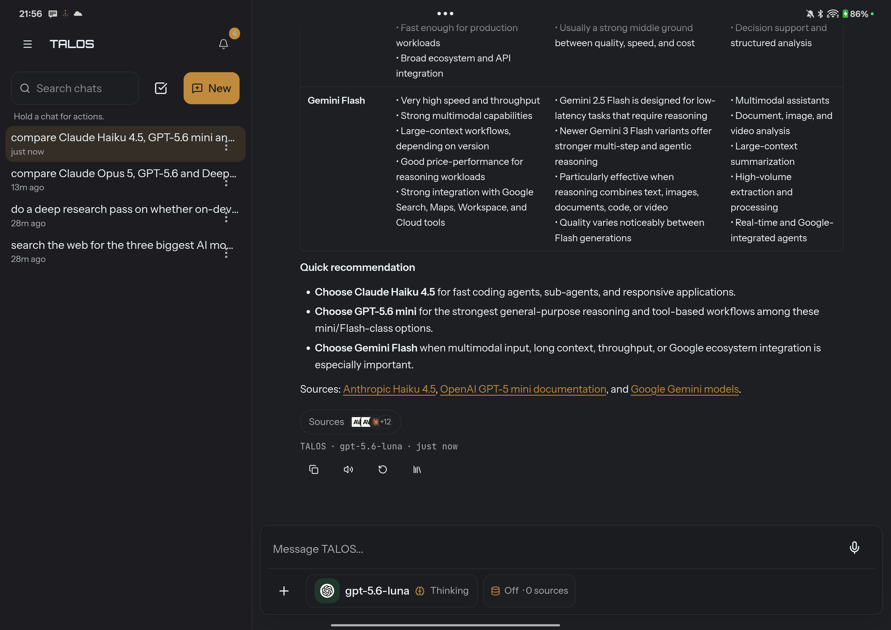
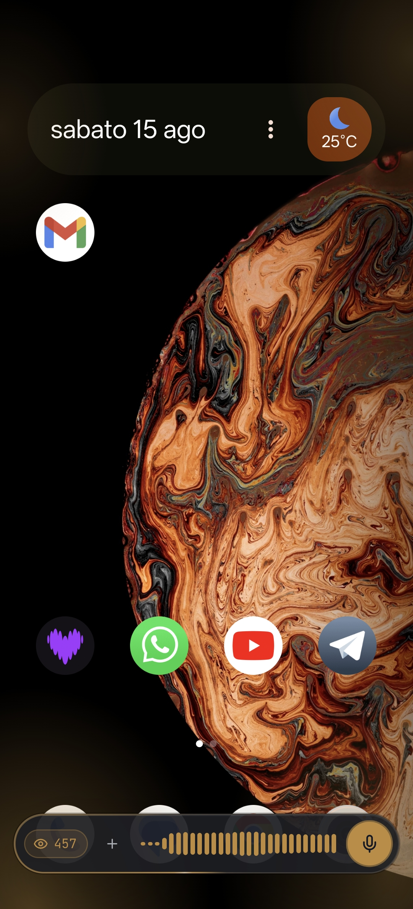
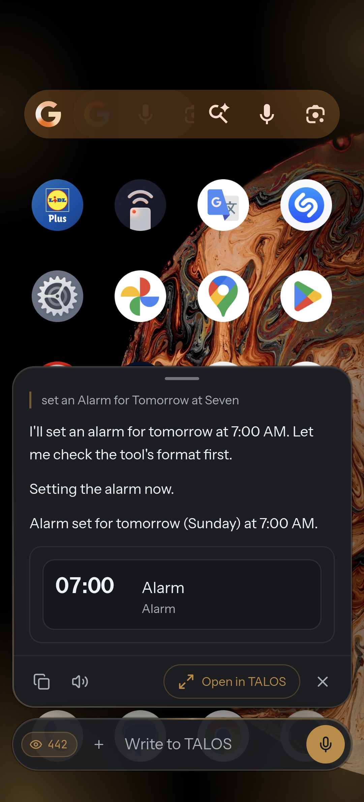
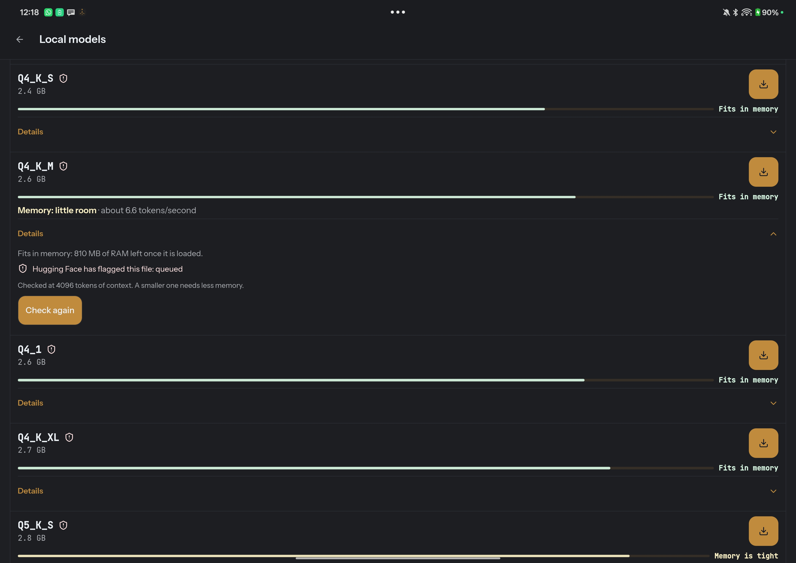
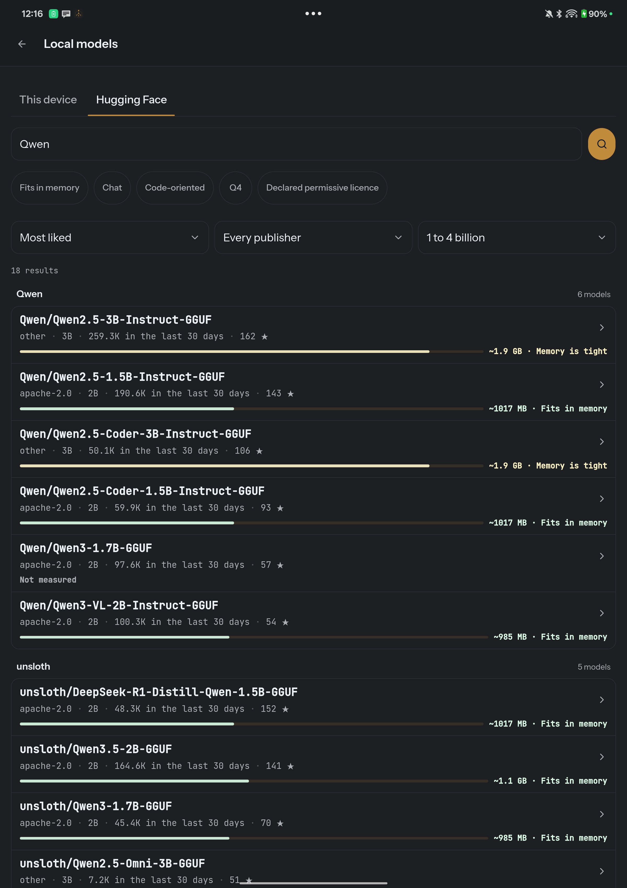
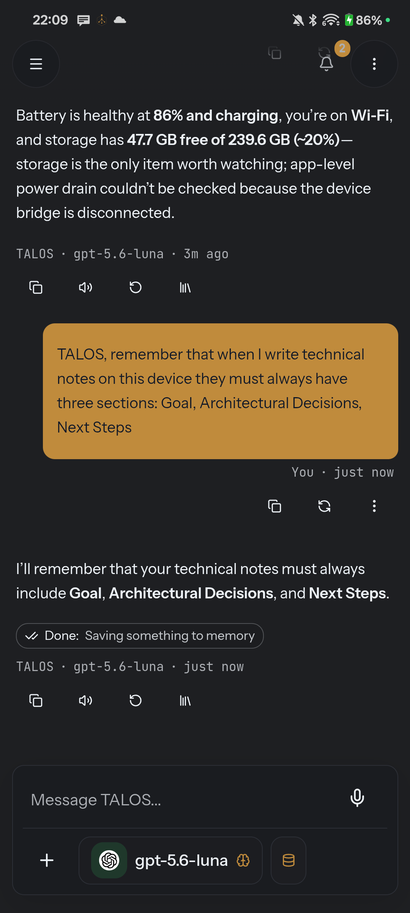
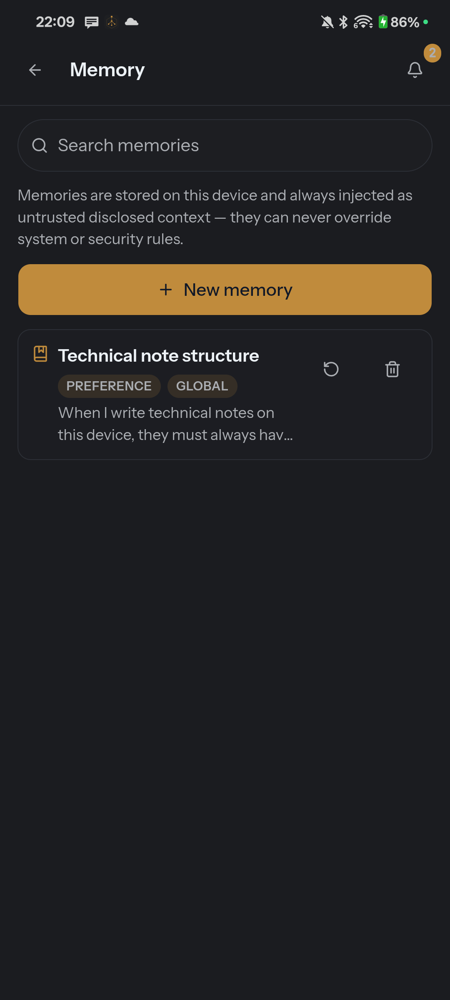

<p align="center">
  
</p>

<p align="center">
  <strong>Your AI. Your phone. Your models. Your rules.</strong>
</p>

<p align="center">
  A local-first AI agent for Android that can reason, remember, research, create, and act across your phone — using a local GGUF model or the cloud model you choose.
</p>

<p align="center">
  <a href="LICENSE"></a>
  <a href="https://github.com/Ninozzz95/talos/actions/workflows/ci.yml"></a>
  
  
  
</p>

---

## Not another chat wrapper

TALOS is an **agentic workspace built around the phone itself**.

It can use a frontier model through your own API key, a local Ollama endpoint, or a GGUF model running inside the Android app. The same agent can search the web, work with your documents, remember things, manage tasks and calendar entries, create content, inspect device state, control Android features, and act inside other apps.

What makes TALOS different is not just *what* it can call. It is **how the harness controls those calls**:

- **69 typed tools**, grouped into personal data, Library, web, creation, models, and device capabilities.
- **Progressive tool disclosure** instead of dumping every schema into every model turn.
- **Explicit `read / write / outbound` authority**, with `allow / ask / deny` and `ask` as the default.
- **Postcondition verification** for actions that can be checked.
- **Local-first state**: no TALOS backend sits between you and your data.
- **Model independence**: OpenAI, Anthropic, Gemini, DeepSeek, OpenRouter, Ollama, and local llama.cpp all sit behind the same product surface.

> TALOS tries to separate **“the model said it worked”** from **“the system observed that it worked.”**

---

## See it



TALOS can do research, compare sources, and present structured results without turning every task into a wall of chat.

<table>
<tr>
<td width="33%"></td>
<td width="33%"></td>
<td width="33%"></td>
</tr>
<tr>
<td><b>Available over what you are doing</b><br>TALOS can surface as an assistant over the current app instead of forcing you through a separate workflow.</td>
<td><b>Acts on the phone</b><br>Alarms, settings, apps, media and other device capabilities are exposed as typed tools.</td>
<td><b>Checks the result</b><br>Where a postcondition is observable, success is based on what happened — not only on a returned string.</td>
</tr>
</table>

---

# What TALOS can do today

| Area | Capabilities |
| --- | --- |
| **Chat & reasoning** | Persistent multi-turn conversations, streaming, reasoning display, dictation, attachments, model switching |
| **Web & research** | Web search/read plus durable research runs that can be listed, read, renamed, paused, resumed, cancelled and deleted |
| **Library / Context Vault** | Keep files on-device, search them, read them into context, export them, rename/delete them and control how they may enter model context |
| **Memory** | Search, write, update and delete typed personal/project memory |
| **Personal workspace** | Notes, tasks and calendar reads/writes from the same agent surface |
| **Creation** | Create documents and invoke configured image generation |
| **Local models** | Discover, inspect, download and run GGUF models through the native llama.cpp engine |
| **Cloud / self-hosted models** | OpenAI, Anthropic, Gemini, DeepSeek, OpenRouter and Ollama |
| **Android control** | Device status, location, torch, media, vibration, volume, alarms, apps, screenshots, settings, speech, wallpaper, wake lock |
| **System controls** | Wi-Fi, Bluetooth, airplane mode, power saving, Do Not Disturb and selected system settings where the device permits them |
| **Notifications & mail** | Unread-mail state, notification listing, reply and dismiss flows |
| **Cross-app actions** | Accessibility-driven screen understanding and actions inside other Android apps |
| **Voice** | Local wake word plus speech input/output surfaces |
| **Diagnostics** | Device/runtime diagnostics designed to report unavailable capabilities instead of silently pretending they exist |

Not every Android ROM exposes the same capabilities. TALOS treats **unsupported**, **denied**, **failed**, and **verified success** as different states.

---

# One agent, many model backends

TALOS is deliberately not tied to one model vendor.

| Backend | Connection |
| --- | --- |
| **OpenAI** | Your API key |
| **Anthropic** | Your API key |
| **Google Gemini** | Your API key |
| **DeepSeek** | Your API key |
| **OpenRouter** | Your API key |
| **Ollama** | Your endpoint |
| **Local** | GGUF through the llama.cpp engine embedded in the Android app |

The provider adapters are lazy-loaded: a conversation using a local model does not need to pull every cloud-provider implementation into the initial application path.

## Local really means local

With a compatible GGUF loaded, model inference happens on the device.

The local path includes:

- native llama.cpp integration;
- device/model-specific runtime tuning;
- KV-cache selection;
- persistent prefix-state caching;
- local tool-schema simplification for constrained grammars;
- progressive tool disclosure to avoid paying the full tool surface on every turn.

A local model and a cloud model do **not** need identical harness settings. TALOS already treats the local path as a different performance envelope instead of pretending that one prompt fits every model.

---

# Running a model on the phone, without pretending

Most apps that "support local models" hand you a list and let you find out the
hard way. A 3 GB download either runs, or swaps, or gets killed by the kernel
halfway through your first sentence — and you learn which by trying.

TALOS answers the question **before** the download.



Hugging Face, browsable from the phone, filtered by what **this** device can
actually hold. Every row carries its own memory bar and its own verdict, and
`Fits in memory` is a filter you can switch on — not a label you read afterwards.
Publisher, licence, parameter band and popularity are there because picking a
model is a real decision, not a lucky dip.

## Every quantisation, measured against your RAM



One repository, its quantisations side by side. The bar is not a size comparison
— it is **your** memory, with the model in it.

```text
Q4_K_M   2.6 GB   Memory: little room · about 6.6 tokens/second
                  Fits in memory: 810 MB of RAM left once it is loaded
                  Checked at 4096 tokens of context
Q5_K_S   2.8 GB   Memory is tight
```

Three things that row does, and each one exists because the alternative was
misleading:

- **It says what is left**, not what is used. `810 MB of RAM left once it is
  loaded` is the number that decides whether the phone stays usable.
- **It names the context it assumed.** A model checked at 4096 tokens needs more
  at 16k, and a verdict that hides its assumption is a verdict you cannot trust.
- **It reports the speed it measured**, on this device, not a figure from a
  spec sheet.

> Peak RSS lies about local models: `llama.cpp` maps the weights with `mmap`, and
> those pages are discardable. Measured on one 1.79 GiB model — 3,869 MB peak,
> but only **2,031 MB** that cannot be dropped. TALOS sizes against the number
> that matters, which is why models other apps refuse will run here.

TALOS also surfaces what Hugging Face says about the file itself — a flagged
upload is shown as flagged, before you download it, not after.

## And then it is just the model you are talking to

Once a model is loaded it uses the same conversation surface, the same tools and
the same permission vocabulary as a frontier model behind an API key. The chip in
the composer is the only thing that changes.

**Measured on a OnePlus Pad 3**, `Holo-3.1-4B Q4_K_M` (4.84B parameters), at 8
threads:

| | tokens/second |
| --- | ---: |
| prefill, 512 tokens | **65.1** ± 0.7 |
| prefill, 2048 tokens | **58.3** ± 1.2 |
| generation, 128 tokens | **12.2** ± 0.1 |

One agent step — 2,000 tokens in, 100 out — takes **43.3 s** on that model, and
35.3 s on a Qwen2.5-3B that has never been trained for device control. The 4B
scores 71.0% on AndroidWorld. That trade is the kind of choice TALOS puts in
your hands instead of making for you.

**This is an active engineering front, not a finished one.** Speculative
decoding, an NPU backend, and per-phase thread counts are measured work in
progress — and the rule for all of them is the project's rule: nothing is true
until the device says so, thermal state included.

---

# The harness is the product

A model is only one part of an agent.

TALOS currently exposes **69 typed tools**. Switching all of them on offers 68 definitions to the model — image generation appears only when an image provider is configured, because a tool that is offered and always fails is worse than one that is not offered — and those definitions weigh **44,926 bytes (~12,142 tokens)** of tool surface per turn.

That measurement is not a claim you have to take on trust:

```bash
npx vitest run tests/unit/tools/pesoDegliSchemi.test.ts
```

So TALOS does not blindly send all of them.

```text
                    USER
                      │
                      ▼
               TALOS conversation
                      │
              select model/provider
                      │
                      ▼
            ┌────────────────────┐
            │   AGENT HARNESS    │
            │                    │
            │ tool disclosure    │
            │ permissions        │
            │ dedup / recovery   │
            │ context            │
            │ verification       │
            └─────────┬──────────┘
                      │
              authorized tool call
                      │
                      ▼
          ┌─────────────────────────┐
          │  Library / Web / Phone  │
          │  Models / Personal data │
          └────────────┬────────────┘
                       │
                  observe result
                       │
                       ▼
                 verified outcome
```

## Progressive tool disclosure

TALOS has measured two separate ways of reducing tool overhead:

- When a provider offers native deferred loading, TALOS can keep most tools out of the active prompt surface until needed.
- For other providers and local models, TALOS can expose a **compact catalog** and reveal full schemas on demand.

With progressive disclosure on, four tools stay in front of the model and the rest are revealed on demand. The same test measures what that leaves in the prefix:

```text
44,926 bytes  (68 tools)
      ↓
 1,868 bytes  (4 tools)
```

— about a **96% reduction** in what the model pays for on every turn. Opening a tool costs one extra round trip, once, the first time it is needed.

The important part is not only price. Large tool sets can also make smaller models select the wrong capability.

---

# It acts under explicit authority

TALOS uses one permission vocabulary everywhere:

| Power | Meaning |
| --- | --- |
| **read** | The capability may observe user/device/private state |
| **write** | The capability may change local state or cause an action |
| **outbound** | Data or an action may cross the device boundary |

Each one can be:

```text
allow
ask
deny
```

The default is:

```text
read     → ask
write    → ask
outbound → ask
```

An approval is bound to the validated tool input rather than to a vague natural-language promise.

That means the model choosing a tool and the executor being allowed to run it are two different decisions.

---

# It verifies actions instead of trusting the model

A tool returning `"success": true` is not necessarily evidence that the world changed.

TALOS tools can define a postcondition verifier.

For a cross-app send flow, for example, evidence can include things such as:

```text
input field emptied
message appeared in the conversation
send control is no longer in the previous state
```

A result can therefore become:

```text
VERIFIED SUCCESS
FAILED
UNABLE TO CONFIRM
```

Those states are intentionally different.

The reverse case matters too: a request can time out after an external side effect actually occurred. TALOS can verify the resulting state instead of blindly retrying and duplicating the action.

---

# Private and untrusted data are tracked differently

TALOS already distinguishes content coming from:

```text
user-direct
derived
external
```

and tracks whether an agent chain has seen:

```text
private data
untrusted external content
```

before allowing a later transmitting capability.

This is designed around a simple rule:

> Reading something private, reading something untrusted, and then sending data outward is materially more dangerous than any one of those operations alone.

Memories and documents are context — **not authority**. Content stored by TALOS cannot override the security policy simply because it was remembered earlier.

---

# Local-first is an architecture, not a toggle

**There is no TALOS backend today.**

TALOS does not proxy your conversations through a TALOS server.

Your local state — conversations, Library content, memory and settings — stays on the device. Cloud-model traffic goes to the provider you configured; web capabilities contact the service required for the operation you invoked.

Three important paths can run without a TALOS server:

### Local inference
The native llama.cpp engine can run a GGUF model directly on Android.

### Local wake word
“Hey TALOS” is recognized by a small ONNX model prepared for the app. Wake-word recognition does not require a cloud round trip.

### Local personal state
Library, memories, notes, tasks and conversation state live on-device.

A future optional sync/backend architecture is an active engineering direction, but it is intended to be **replication and execution infrastructure**, not a requirement for TALOS to exist locally.

---

# Memory you can inspect

<table>
<tr>
<td width="50%"></td>
<td width="50%"></td>
</tr>
<tr>
<td><b>Teach it in conversation</b><br>Memory writes are agent capabilities, not a hidden side channel.</td>
<td><b>See and control what remains</b><br>Memories are typed, scoped, editable and deletable.</td>
</tr>
</table>

---

# Android is not just a display target

TALOS can reason about the actual device state and expose Android as an agent environment.

Examples currently represented in the tool surface include:

```text
status        location       torch
media         vibration      volume
alarms        open app       screenshots
settings      speech         wallpaper
wake lock     Wi-Fi          Bluetooth
airplane mode power saving   Do Not Disturb
app usage     installed apps notifications
notification reply/dismiss   calendar
screen driving               file sharing
```

Some controls require Android system permission, Accessibility, or the optional ADB bridge. Availability is checked at runtime.

---

# Architecture

```text
┌───────────────────────────────────────────────────────┐
│                    Android / Vue UI                   │
│ Chat · Overlay · Library · Memory · Settings · Doctor│
└──────────────────────────┬────────────────────────────┘
                           │
                           ▼
┌───────────────────────────────────────────────────────┐
│                     Agent Harness                     │
│                                                       │
│ model adapter       progressive tools                 │
│ permissions         authorization binding             │
│ security chain      dedup / recovery                  │
│ tool execution      postcondition verification        │
└───────────────┬───────────────────────┬───────────────┘
                │                       │
                ▼                       ▼
┌──────────────────────────┐  ┌─────────────────────────┐
│      Model backends      │  │      Capabilities       │
│ Local llama.cpp          │  │ Library / Research      │
│ OpenAI / Anthropic       │  │ Personal / Creation     │
│ Gemini / DeepSeek        │  │ Android / Other apps    │
│ OpenRouter / Ollama      │  │ Model management        │
└──────────────────────────┘  └─────────────────────────┘
```

---

# Current engineering direction

The project is moving toward a **next-generation adaptive harness**, not toward coupling itself more tightly to one model.

The active R&D direction is to make the harness itself measurable and replaceable:

```text
task
× model
× provider
× device
× permissions
× execution environment
      │
      ▼
compiled harness profile
```

The goal is for different models to receive different tool surfaces, context policies and execution strategies based on measured performance.

Other active directions include:

- a coding workspace;
- code intelligence and execution backends;
- durable task/operation state;
- stronger proof and reversible changes;
- optional backend/device synchronization;
- desktop/CLI surfaces.

**These are roadmap directions, not claims about what is already shipped.**

---

# Install

Releases carry a signed APK for `arm64-v8a`, Android 8.0 or newer. It does not
come from the Play Store, so Android will ask you to confirm an app from an
unknown source — that is expected.

Two commands are worth running before you install it. The first checks you
downloaded the file that was published:

```bash
sha256sum TALOS-<version>.apk     # compare with the hash in the release notes
```

The second checks the file was built by this repository, from this code, by the
workflow you can read — not by someone who rebuilt it elsewhere:

```bash
gh attestation verify TALOS-<version>.apk --repo Ninozzz95/talos
```

That second one is the point. A build provenance attestation nobody verifies is
decoration, so the command lives here and in every release, rather than in a
documentation page.

---

# Build

## Requirements

The current repository pins its JavaScript toolchain:

```text
Node >= 24.18.0 and < 25
npm  >= 11.16.0 and < 12
```

Android build configuration currently uses:

```text
compileSdk 36
targetSdk 36
minSdk 26
arm64-v8a only
NDK 27.0.12077973
```

You also need a compatible JDK and Android SDK/NDK toolchain.

## Get the sources

The local inference engine is a git submodule, not a copy in this repository —
so the upstream project keeps its own history and attribution.

```bash
git clone https://github.com/Ninozzz95/talos.git
cd talos
git submodule update --init --depth 1
```

> **On Windows, do this first:** `git config --global core.longpaths true`.
> Some paths inside llama.cpp exceed the 260-character limit and the checkout
> stops halfway with `Filename too long`, leaving a submodule that looks present
> and is incomplete.

## Web / unit build

```bash
npm ci
npm run typecheck
npm run test:unit
npm run build
```

## Android

```bash
npx cap sync android
cd android
./gradlew assembleDebug -PtalosSideBySide
```

`-PtalosSideBySide` builds the development package beside an existing release installation instead of replacing its local data.

### Optional Git Bash launcher tests

The launcher intentionally keeps its native dependency isolated:

```bash
cd tools/git-bash-launcher
npm ci
```

`node-pty` should not be added to the main application's dependency graph.

---

# Platform status

The Android build currently declares:

```text
minSdk 26
targetSdk 36
ABI arm64-v8a
```

The project is actively validated on modern Android hardware, including a OnePlus phone and tablet. OEM Android variants differ materially in Accessibility, background execution, lock-screen behavior and battery management, so TALOS prefers measured capability checks over hardcoded assumptions.

This is a young project. It is used actively, but it should still be treated as experimental software rather than infrastructure you cannot afford to lose.

---

# Permissions

TALOS asks for powerful Android capabilities only when the corresponding feature needs them.

| Permission / capability | Why TALOS may need it |
| --- | --- |
| **Microphone** | Dictation and local wake word |
| **Accessibility** | Read actionable UI structure and interact with other apps |
| **Location** | Location-specific requests |
| **Contacts** | Resolve a person for an explicit communication action |
| **Calendar** | Read or modify calendar state |
| **Camera** | Capture an attachment through the system camera |
| **Notifications** | Inspect, reply to or dismiss notification state where allowed |
| **ADB bridge** | Selected system operations Android apps cannot normally perform |

The permission screen is only one layer. Agent tools still pass through TALOS's own `read / write / outbound` policy.

---

# What TALOS is not

**Not a TALOS-hosted SaaS proxy.**  
There is no required TALOS cloud backend today.

**Not tied to one model company.**  
The model is selected by the user.

**Not a blind macro engine.**  
Tools have typed contracts, security metadata and — where possible — postconditions.

**Not “local” only because the UI is local.**  
TALOS includes an actual native local inference path.

**Not finished.**  
Some Android behaviors remain device/OEM-specific, and major coding/harness capabilities are active engineering work.

---

# Contributing

See [CONTRIBUTING.md](CONTRIBUTING.md).

The codebase deliberately contains extensive comments explaining **the measured failure that caused a guard or architectural decision to exist**. Many comments are written in Italian; identifiers and APIs are English.

Issues and pull requests in English are welcome.

A useful contribution should preserve the central project rule:

> If TALOS claims that something happened in the real world, there should be a way to demonstrate why it believes that.

---

# License

[Apache License 2.0](LICENSE).

Third-party components and shipped-binary provenance are documented in [NOTICE](NOTICE).
