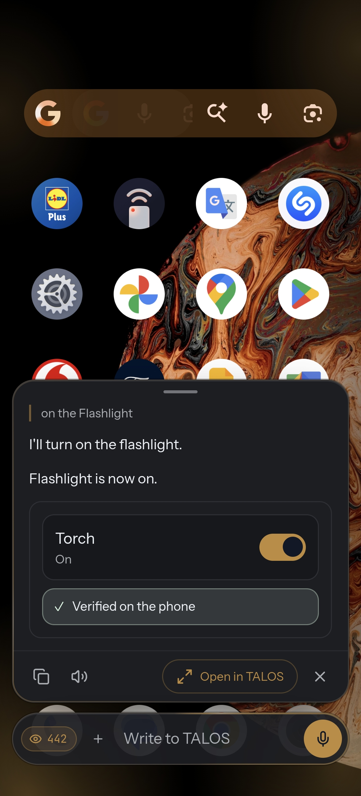

<p align="center">
  <picture>
    <source media="(prefers-color-scheme: light)" srcset="mobile/docs/immagini/talos-logo-chiaro.png">
    
  </picture>
</p>

<p align="center">
  <strong>An agent that has to prove it did the work.</strong>
</p>

<p align="center">
  Local-first AI agent for Android, and a coding harness for the desktop, built on the same rules:
  explicit authority, verified outcomes, a receipt for every action.
</p>

<p align="center">
  <a href="LICENSE"></a>
  <a href="https://github.com/Ninozzz95/agent-virtual-machine/actions/workflows/ci.yml"></a>
  
</p>

---

## Two products, one harness

<table>
<tr>
<td width="50%" valign="top">

<h3>TALOS Mobile</h3>
<p>A personal agent for Android that reasons, remembers, researches and acts across the phone, with a local GGUF model or the cloud model you choose. 69 typed tools, progressive tool disclosure, postcondition verification. No server, no account.</p>
<p><a href="mobile/README.md"><strong>Read more →</strong></a></p>
</td>
<td width="50%" valign="top">

<h3>Harness Desktop</h3>
<p>A local coding agent with a real terminal, review and diff, automations, hooks, MCP, skills and plugins, driven by any model over OpenRouter. Every session is a replayable event log. Runs on <code>127.0.0.1</code> only.</p>
<p><a href="harness-ui/README.md"><strong>Read more →</strong></a></p>
</td>
</tr>
</table>

## What sets TALOS apart

| | TALOS | Most coding agents |
|---|---|---|
| **Authority** | Every tool declares `read / write / outbound`; the user sets `allow / ask / deny` per tool. Denylist is never the safety model. | A single "auto-approve" switch, or a denylist of dangerous commands. |
| **Receipts** | Each operation with side effects produces a signed receipt: what was asked, what ran, what changed. | A log line, if anything. |
| **Verification** | "The model said it worked" is separated from "the system observed that it worked". Observable postconditions decide success. | The model's own summary is the result. |
| **Semantic gate** | Writes are checked against the declared premise of the task, not only against "does it compile". | Compile or test pass is the only gate. |
| **Replay** | A session is an event stream. Fork it, resume it, replay it after a restart, with cost accounted per event. | Chat history, sometimes with checkpoints. |
| **Local-first** | Mobile runs standalone on the phone. Desktop binds to loopback and reads only its own project workspace. | A cloud account or a hosted runtime is the default path. |
| **One UI** | Mobile and desktop share the same harness UI and the same tool contracts. | Separate products with separate behaviour. |

Every row above points to code in this repository, not to a roadmap. Where a feature is still partial, the product README says so instead of hiding it.

## Install

**Mobile** — download the signed APK from the latest [release of Ninozzz95/talos](https://github.com/Ninozzz95/talos/releases) (`arm64-v8a`, Android 8.0+), then verify it:

```bash
sha256sum TALOS-<version>.apk
gh attestation verify TALOS-<version>.apk --repo Ninozzz95/talos
```

**Desktop** — Node.js 24 and Google Chrome, nothing to install for the frontend:

```powershell
node harness-ui/server.mjs
```

Then open `http://127.0.0.1:4174/`. Set `OPENROUTER_API_KEY` to start sessions; without it the server runs read-only.

## Repository map

- [`mobile/`](mobile/README.md) — the Android app (Capacitor, Vue, llama.cpp).
- [`harness-ui/`](harness-ui/README.md) — Harness Desktop, backend and UI.
- [`docs/`](docs/README.md) — architecture notes, security model, benchmark methodology.
- [`CHANGELOG.md`](CHANGELOG.md) · [`CONTRIBUTING.md`](CONTRIBUTING.md) · [`SECURITY.md`](SECURITY.md)

## License

Apache 2.0. See [LICENSE](LICENSE) and [THIRD_PARTY_NOTICES.md](THIRD_PARTY_NOTICES.md).
