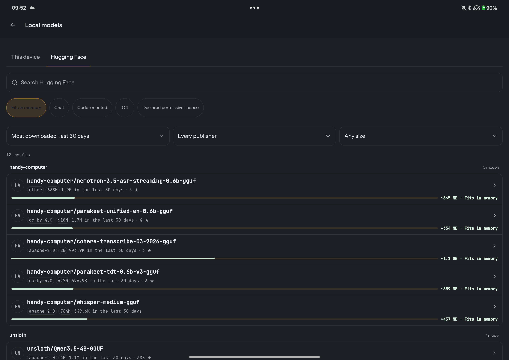
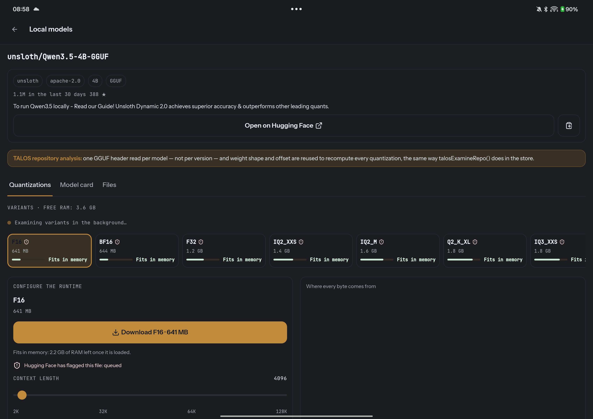
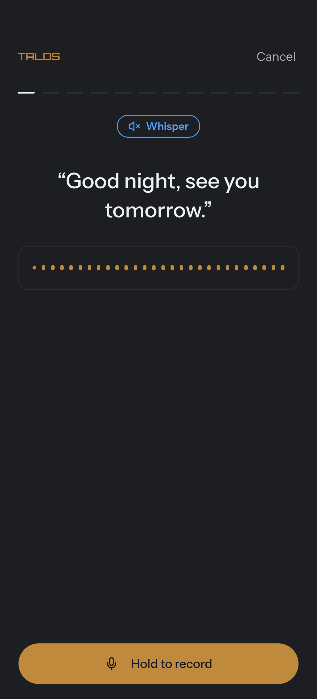

<p align="center">
  <picture>
    <source media="(prefers-color-scheme: light)" srcset="docs/immagini/talos-logo-chiaro.png">
    
  </picture>
</p>

<p align="center">
  <strong>Your AI. Your phone. Your models. Your rules.</strong>
</p>

<p align="center">
  A local-first AI agent for Android that can reason, remember, research, create, and act across your phone — using a local GGUF model or the cloud model you choose.
</p>

<p align="center">
  <a href="LICENSE"></a>
  <a href="https://github.com/Ninozzz95/talos/actions/workflows/ci.yml"></a>
  
  
  
</p>

---

## Not another chat wrapper

TALOS is an **agentic workspace built around the phone itself**.

It can use a frontier model through your own API key, an Ollama endpoint, or a GGUF model running inside the Android app. The same agent can search the web, work with documents, remember things, manage tasks and calendars, create content, inspect device state, control Android features, and act inside other apps.

The harness controls those actions through:

- **69 typed tools** across personal data, Library, web, creation, models and device capabilities;
- **progressive tool disclosure** instead of sending every schema on every turn;
- explicit **`read / write / outbound` authority** with `allow / ask / deny`;
- **postcondition verification** for observable actions;
- **local-first state**, with no required TALOS backend;
- model independence across OpenAI, Anthropic, Gemini, DeepSeek, OpenRouter, Ollama and local llama.cpp.

> TALOS separates **“the model said it worked”** from **“the system observed that it worked.”**

---

## See it


TALOS can research, compare sources and present structured results without turning every task into a wall of chat.

<table>
<tr>
<td width="33%"></td>
<td width="33%"></td>
<td width="33%"></td>
</tr>
<tr>
<td><b>Available over what you are doing</b><br>TALOS can surface over the current app instead of forcing a separate workflow.</td>
<td><b>Acts on the phone</b><br>Alarms, settings, apps, media and other device capabilities are exposed as typed tools.</td>
<td><b>Checks the result</b><br>Where a postcondition is observable, success depends on what actually happened.</td>
</tr>
</table>

---

# What TALOS can do today

| Area | Capabilities |
| --- | --- |
| **Chat & reasoning** | Persistent conversations, streaming, reasoning display, dictation, attachments, model switching |
| **Web & research** | Web search/read and durable research runs that can be listed, read, renamed, paused, resumed, cancelled and deleted |
| **Library / Context Vault** | Keep files on-device, search/read them into context, export, rename/delete and control context access |
| **Memory** | Search, write, update and delete typed personal/project memory |
| **Personal workspace** | Notes, tasks and calendar reads/writes |
| **Creation** | Document creation and configured image generation |
| **Local models** | Discover, inspect, download and run GGUF models through native llama.cpp |
| **Cloud / self-hosted models** | OpenAI, Anthropic, Gemini, DeepSeek, OpenRouter and Ollama |
| **Android control** | Device status, location, torch, media, vibration, volume, alarms, apps, screenshots, settings, speech, wallpaper, wake lock |
| **System controls** | Wi-Fi, Bluetooth, airplane mode, power saving, Do Not Disturb and selected system settings where permitted |
| **Notifications & mail** | Unread-mail state, notification listing, reply and dismiss flows |
| **Cross-app actions** | Accessibility-driven screen understanding and actions inside other Android apps |
| **Voice** | Local wake word, dictation, and replies read back in your own trained voice |
| **Diagnostics** | Runtime capability checks that distinguish unavailable features from successful ones |

Android ROMs expose different capabilities. TALOS treats **unsupported**, **denied**, **failed** and **verified success** as distinct states.

---

# One agent, many model backends

TALOS is not tied to one model vendor.

| Backend | Connection |
| --- | --- |
| **OpenAI** | Your API key |
| **Anthropic** | Your API key |
| **Google Gemini** | Your API key |
| **DeepSeek** | Your API key |
| **OpenRouter** | Your API key |
| **Ollama** | Your endpoint |
| **Local** | GGUF through llama.cpp embedded in the Android app |

Provider adapters are lazy-loaded, so a local conversation does not need every cloud-provider implementation in the initial application path.

## Local really means local

With a compatible GGUF loaded, inference happens on-device.

The local path includes native llama.cpp integration, an OpenCL GPU backend that is offered only after the device passes a real qualification check (never assumed from a chipset name), device/model-specific runtime tuning, KV-cache selection, persistent prefix-state caching, local tool-schema simplification for constrained grammars and progressive tool disclosure.

Local and cloud models can use different harness settings because they operate under different performance constraints.

### The engine keeps getting faster, and every claim here is a measurement

A persistent OpenCL kernel cache removed a multi-second first-generation recompile that used to run on every app start. Prompt processing moved to a larger microbatch, measured to shorten it rather than assumed to help. The static part of the system prompt is now pre-computed once instead of on every message. A native thread pool replaced manual thread lifecycle management, and CPU core affinity was tested with a paired A/B campaign rather than switched on because it sounded right — it made no measurable difference on the reference hardware, so the default did not change on the strength of a hunch.

That is also the house rule for what does **not** ship by default: Flash Attention is not force-enabled globally, "use every core" is not a universal default, and the KV-cache type is not chosen from free RAM alone. Where a change could not clear that bar, it stayed off — a negative result is still a result.

## Know whether a model fits before downloading it



TALOS can browse Hugging Face from the phone and filter models by what **this device** can actually hold. Each model includes a memory verdict, while publisher, licence, parameter band and popularity help make the choice explicit.

Opening a model splits it into three tabs — quantizations, the full model card, and the raw file list — instead of one long scroll. Every quantization is checked against your device automatically as soon as the page opens.

### Every quantisation, measured against your RAM



A resource ledger shows exactly where each memory estimate comes from — weights and file size are exact, the KV-cache size is exact once the header is read, compute and runtime overhead are the app's own declared safety margin — instead of a single unexplained number. The KV-cache type can be forced globally (F16 or Q8_0) instead of only reading whatever the file happened to ship with, and the resolved type is always shown, even on Automatic.

Quantisations are shown against the device's actual memory:

```text
Q4_K_M   2.6 GB   Memory: little room · about 6.6 tokens/second
                  Fits in memory: 810 MB of RAM left once it is loaded
                  Checked at 4096 tokens of context
Q5_K_S   2.8 GB   Memory is tight
```

TALOS reports:

- **RAM left after loading**, not just model size;
- the **context length** assumed by the estimate;
- **measured speed** on the device.

> Peak RSS can misrepresent local-model memory because `llama.cpp` maps weights with `mmap`. On one measured 1.79 GiB model, peak RSS was 3,869 MB while only **2,031 MB** could not be dropped. TALOS sizes against the latter.

Hugging Face file warnings are also surfaced before download.

Once loaded, a local model uses the same conversation surface, tools and permission vocabulary as a frontier API model.

**Measured on a OnePlus Pad 3**, `Holo-3.1-4B Q4_K_M` (4.84B parameters), at 8 threads:

| | tokens/second |
| --- | ---: |
| prefill, 512 tokens | **65.1** ± 0.7 |
| prefill, 2048 tokens | **58.3** ± 1.2 |
| generation, 128 tokens | **12.2** ± 0.1 |

One agent step — 2,000 tokens in, 100 out — takes **43.3 s** on that model and **35.3 s** on a Qwen2.5-3B not trained for device control. The 4B scores **71.0% on AndroidWorld**.

Speculative decoding, an NPU backend and per-phase thread counts remain measured work in progress. Thermal state is part of those measurements.

---

# The harness is the product

TALOS currently exposes **69 typed tools**. With all available tools enabled, 68 definitions are offered to the model — image generation appears only when configured — weighing **45,116 bytes (~12,194 tokens)** per turn.

You can reproduce the measurement:

```bash
npx vitest run tests/unit/tools/pesoDegliSchemi.test.ts
```

```text
                    USER
                      │
                      ▼
               TALOS conversation
                      │
              select model/provider
                      │
                      ▼
            ┌────────────────────┐
            │   AGENT HARNESS    │
            │                    │
            │ tool disclosure    │
            │ permissions        │
            │ dedup / recovery   │
            │ context            │
            │ verification       │
            └─────────┬──────────┘
                      │
              authorized tool call
                      │
                      ▼
          ┌─────────────────────────┐
          │  Library / Web / Phone  │
          │  Models / Personal data │
          └────────────┬────────────┘
                       │
                  observe result
                       │
                       ▼
                 verified outcome
```

## Progressive tool disclosure

When supported, TALOS uses native deferred loading. Otherwise, cloud and local models can receive a **compact catalog** and request full schemas on demand.

With progressive disclosure enabled:

```text
45,116 bytes  (68 tools)
      ↓
 1,868 bytes  (4 tools)
```

That is about a **96% reduction** in persistent tool surface. Revealing a tool costs one additional round trip the first time it is needed.

Besides reducing prompt cost, smaller tool surfaces can help constrained models avoid selecting the wrong capability.

---

# Authority, verification and data safety

## Explicit authority

Every capability uses the same permission vocabulary:

| Power | Meaning |
| --- | --- |
| **read** | Observe user/device/private state |
| **write** | Change local state or cause an action |
| **outbound** | Send data or an action across the device boundary |

Each can be:

```text
allow
ask
deny
```

Default:

```text
read     → ask
write    → ask
outbound → ask
```

Approval is bound to validated tool input, so choosing a tool and being authorized to execute it are separate decisions.

## Postcondition verification

A tool returning `"success": true` does not necessarily prove the world changed.

Tools can define postcondition verification. For a cross-app send flow, evidence might include:

```text
input field emptied
message appeared in the conversation
send control is no longer in the previous state
```

Results can therefore become:

```text
VERIFIED SUCCESS
FAILED
UNABLE TO CONFIRM
```

This also helps when a request times out after an external side effect already occurred: TALOS can inspect the resulting state instead of blindly retrying and duplicating the action.

## Private and untrusted data

TALOS distinguishes content originating as:

```text
user-direct
derived
external
```

and tracks whether an agent chain has encountered:

```text
private data
untrusted external content
```

before a later transmitting capability is allowed.

Reading private data, consuming untrusted content and then transmitting outward is treated as more dangerous than any one operation alone.

Memories and documents are **context, not authority**: stored content cannot override the security policy.

---

# Local-first by architecture

**There is no TALOS backend today.**

TALOS does not proxy conversations through a TALOS server. Conversations, Library content, memory and settings stay on-device. Cloud-model traffic goes directly to the configured provider; web capabilities contact the service required for the requested operation.

Three important paths work without a TALOS server:

- **Local inference** — GGUF models run directly through native llama.cpp.
- **Local wake word** — “Hey TALOS” uses a small ONNX model without a cloud round trip.
- **Local personal state** — Library, memories, notes, tasks and conversations live on-device.

A future optional backend/sync architecture is intended as **replication and execution infrastructure**, not as a requirement for TALOS to function locally.

## Memory you can inspect

<table>
<tr>
<td width="50%"></td>
<td width="50%"></td>
</tr>
<tr>
<td><b>Teach it in conversation</b><br>Memory writes are agent capabilities, not a hidden side channel.</td>
<td><b>See and control what remains</b><br>Memories are typed, scoped, editable and deletable.</td>
</tr>
</table>

---

# Your own voice, not a stock one



You record twelve short phrases once, on-device. TALOS builds a voice profile from them, and from then on a reply can be read back in *your* voice instead of a generic text-to-speech voice.

A live waveform moves with your voice while you record, and a quiet-room check runs before the wizard starts so you know the room is actually quiet before you speak. Recordings never leave the device: they are encrypted with a key held in the phone's hardware keystore, and once the profile is built the raw audio is destroyed — what remains is the profile, not the recording.

The synthesis engine is [Kyutai's Pocket TTS](https://github.com/kyutai-labs/pocket-tts) (MIT), running fully on-device through ONNX Runtime. Measured on production streaming: **-23.2 LUFS**, true peak **-0.8 dBFS**, time to first audio **449–537 ms** warm. Italian speech recognition against a 6-sentence reference set: **6/6 exact, zero word error rate**.

---

# Android is an agent environment

TALOS can inspect real device state and expose Android capabilities through typed tools:

```text
status        location       torch
media         vibration      volume
alarms        open app       screenshots
settings      speech         wallpaper
wake lock     Wi-Fi          Bluetooth
airplane mode power saving   Do Not Disturb
app usage     installed apps notifications
notification reply/dismiss   calendar
screen driving               file sharing
```

Some operations require Android system permissions, Accessibility or the optional ADB bridge. Availability is checked at runtime.

---

# Architecture

```text
┌───────────────────────────────────────────────────────┐
│                    Android / Vue UI                   │
│ Chat · Overlay · Library · Memory · Settings · Doctor│
└──────────────────────────┬────────────────────────────┘
                           │
                           ▼
┌───────────────────────────────────────────────────────┐
│                     Agent Harness                     │
│                                                       │
│ model adapter       progressive tools                 │
│ permissions         authorization binding             │
│ security chain      dedup / recovery                  │
│ tool execution      postcondition verification        │
└───────────────┬───────────────────────┬───────────────┘
                │                       │
                ▼                       ▼
┌──────────────────────────┐  ┌─────────────────────────┐
│      Model backends      │  │      Capabilities       │
│ Local llama.cpp          │  │ Library / Research      │
│ OpenAI / Anthropic       │  │ Personal / Creation     │
│ Gemini / DeepSeek        │  │ Android / Other apps    │
│ OpenRouter / Ollama      │  │ Model management        │
└──────────────────────────┘  └─────────────────────────┘
```

---

# Coming soon: a coding agent, built on the same rules


*(Internal build shown in Italian — the UI text is being translated to English before this ships.)*

TALOS's own coding agent is under active development, on the same principles as the rest of the project: typed tools, explicit authority, and results that are checked instead of assumed.

It already runs against real projects today — read/search/edit/test, a sandboxed shell (WSL2 first, honestly labelled `none` when no isolation is available, never a silent bluff), and an SSRF-safe page reader ported from TALOS's own on-device web-reading policy (DNS pinning, redirect revalidation, no private-network access) — driven through the same kind of typed-tool loop already shipping in the app, benchmarked against other coding agents on cost-per-solved-task rather than vibes.

What's still ahead: bringing it into the phone itself, a persisted session model with fork/resume/compact, and the same UI surfacing on both the desktop tooling and the mobile app instead of two implementations of the same idea.

**This is a roadmap direction. It does not run inside the shipped Android app yet.**

---

# Current engineering direction

TALOS is moving toward a **next-generation adaptive harness**, rather than tighter coupling to one model:

```text
task
× model
× provider
× device
× permissions
× execution environment
      │
      ▼
compiled harness profile
```

The goal is to give different models different tool surfaces, context policies and execution strategies based on measured performance.

Active directions also include:

- the coding agent harness described above;
- a per-device performance profile that reads real headroom (CPU/GPU/thermal margin) instead of guessing from a chipset name;
- a controlled qualification lane for candidate engine updates, so a change to the inference engine is verified before it becomes the default rather than after;
- code intelligence and execution backends;
- durable task/operation state;
- stronger proof and reversible changes;
- optional backend/device synchronization.

**These are roadmap directions, not claims about shipped functionality.**

---

# Install

Releases include a signed APK for **`arm64-v8a` on Android 8.0+**. Because TALOS is not distributed through the Play Store, Android will ask you to confirm installation from an unknown source.

Verify the downloaded file against the release hash:

```bash
sha256sum TALOS-<version>.apk
```

Then verify that it was built by this repository's workflow:

```bash
gh attestation verify TALOS-<version>.apk --repo Ninozzz95/talos
```

The provenance command is intentionally documented here and in each release so the attestation can actually be checked.

---

# Build

## Requirements

JavaScript toolchain:

```text
Node >= 24.18.0 and < 25
npm  >= 11.16.0 and < 12
```

Android configuration:

```text
compileSdk 36
targetSdk 36
minSdk 26
arm64-v8a only
NDK 27.0.12077973
```

A compatible JDK and Android SDK/NDK toolchain are also required.

## Get the sources

Local inference uses llama.cpp as a git submodule:

```bash
git clone https://github.com/Ninozzz95/talos.git
cd talos
git submodule update --init --depth 1
```

> **Windows:** run `git config --global core.longpaths true` first. Some llama.cpp paths exceed the traditional 260-character limit and otherwise leave an incomplete checkout.

## Web / unit build

```bash
npm ci
npm run typecheck
npm run test:unit
npm run build
```

## Android

```bash
npx cap sync android
cd android
./gradlew assembleDebug -PtalosSideBySide
```

`-PtalosSideBySide` installs the development package beside an existing release instead of replacing its local data.

### Optional Git Bash launcher tests

```bash
cd tools/git-bash-launcher
npm ci
```

The launcher's `node-pty` dependency is intentionally isolated and should not be added to the main application dependency graph.

---

# Platform status

The Android build declares:

```text
minSdk 26
targetSdk 36
ABI arm64-v8a
```

TALOS is actively validated on modern Android hardware, including a OnePlus phone and tablet.

OEM variants differ in Accessibility, background execution, lock-screen behavior and battery management, so TALOS prefers runtime capability checks over hardcoded assumptions.

This is a young, actively used project and should still be treated as **experimental software**, not irreplaceable infrastructure.

---

# Permissions

Powerful Android permissions are requested only when the corresponding feature needs them.

| Permission / capability | Why TALOS may need it |
| --- | --- |
| **Microphone** | Dictation and local wake word |
| **Accessibility** | Read actionable UI structure and interact with other apps |
| **Location** | Location-specific requests |
| **Contacts** | Resolve a person for an explicit communication action |
| **Calendar** | Read or modify calendar state |
| **Camera** | Capture an attachment through the system camera |
| **Notifications** | Inspect, reply to or dismiss notification state where allowed |
| **ADB bridge** | Selected system operations Android apps cannot normally perform |

Android permissions are only one layer: agent tools must still pass TALOS's own `read / write / outbound` policy.

---

# What TALOS is not

- **Not a TALOS-hosted SaaS proxy.** There is no required TALOS cloud backend today.
- **Not tied to one model company.** The user selects the model.
- **Not a blind macro engine.** Tools have typed contracts, security metadata and, where possible, postconditions.
- **Not “local” only because the UI is local.** TALOS has a native local inference path.
- **Not finished.** Android behavior remains partly device/OEM-specific, while major coding and harness capabilities remain active engineering work.

---

# Contributing

See [CONTRIBUTING.md](CONTRIBUTING.md).

The codebase contains extensive comments explaining **the measured failure behind guards and architectural decisions**. Many comments are in Italian; identifiers and APIs are English.

Issues and pull requests in English are welcome.

> If TALOS claims that something happened in the real world, there should be a way to demonstrate why it believes that.

---

# On how this was built

TALOS was written with heavy use of AI coding editors, including Claude Opus 5 and GPT-5.6.

Those tools did not decide the product.

The vision, ideas, architecture, testing, implementation decisions and operational steps came from **one human mind**. Every measured number in this README comes from a real-device test; guards exist because the failure they prevent was encountered and investigated.

Using AI this heavily to build software is a legitimate point of disagreement. The project is here to be installed, tested and judged by its actual behavior.

---

# License

[Apache License 2.0](LICENSE).

Third-party components and shipped-binary provenance are documented in [NOTICE](NOTICE).