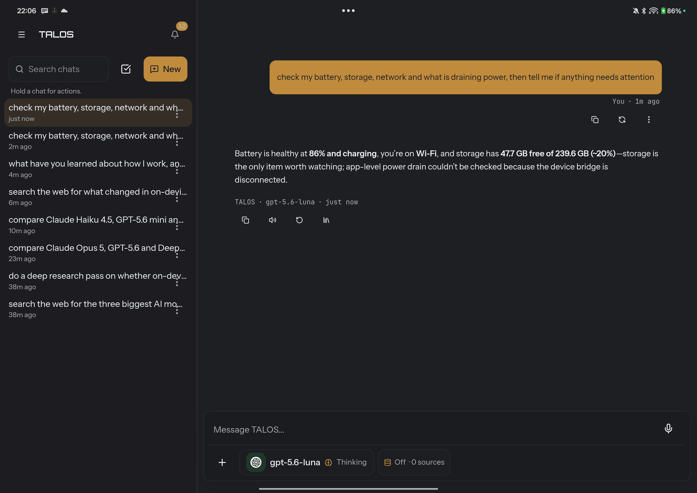

# TALOS

An Android assistant that actually does things on your phone — and tells you the
truth about what happened.

[](LICENSE)
[](#building-it)
[](#status)
[](#what-it-does)

<!--
  ⛔ IL BADGE DELLA CI NON C'È, ED È VOLUTO.
  La CI esiste (.github/workflows/ci.yml) ma non è mai girata: il badge sarebbe
  verde per finta. Si aggiunge dopo il primo push, quando dice una cosa vera.
  Un badge che mente è peggio di un badge assente.
-->

```
you:    manda a Shadina su WhatsApp che sto arrivando
TALOS:  ✓ inviato

        press=true via=viewId in 719 ms
        obiettivo=PARTITO (campo-vuoto=true migrato=true prove=3/3)
```

That second block is the point. TALOS does not say "sent" because it called a
function: it says "sent" because three independent checks on the screen agree —
the input field is empty, the text has moved into the conversation, and the send
control is gone. When only one check agrees, it says so.

---

## See it


**Ask something that takes real work.** TALOS searches, compares, and tells you
what it would pick — with every source it read, and a note about the ones it
could not verify.

### Without leaving the app you are in

<table>
<tr>
<td width="33%"></td>
<td width="33%"></td>
<td width="33%"></td>
</tr>
<tr>
<td><b>Call it from anywhere</b><br>The bar opens on top of whatever is on screen. It does not take you into an app and leave you there.</td>
<td><b>It does the thing</b><br>"Set an alarm for tomorrow at seven" — and the alarm comes back as a card, not as a sentence you have to trust.</td>
<td><b>And proves it</b><br>A live switch you can still press, and a line that says the phone was actually checked.</td>
</tr>
</table>

### What it remembers, and what it knows about your phone

<table>
<tr>
<td width="33%"></td>
<td width="33%"></td>
<td width="33%"></td>
</tr>
<tr>
<td><b>Teach it once</b><br>Say what you want remembered, in the middle of a normal conversation. It saves it and tells you it did.</td>
<td><b>And see everything it kept</b><br>Every memory is on your device, scoped, typed, and deletable — and can never override a security rule.</td>
<td><b>It reads your phone, and says what it cannot</b><br>Battery, storage, network — measured. When a capability is unavailable it says so instead of guessing.</td>
</tr>
</table>

## How it works

```
  you speak or type
        |
        v
  +-----------+   what's on screen    +---------------+
  |   TALOS   | --------------------> | accessibility |
  |  the bar  | <-------------------- |    service    |
  +-----+-----+   elements + state    +---------------+
        |
        | picks a tool, and asks you first if it matters
        v
  +-----------+                       +---------------+
  |   tools   | --------------------> |  your phone   |
  |    40+    |                       |  other apps   |
  +-----+-----+                       +-------+-------+
        |                                     |
        |         then it CHECKS  <-----------+
        v
  "sent" only if the field emptied, the text moved into the
  conversation, and the send control disappeared.
  Two out of three, or it says it could not confirm.
```

## What it does

**Talks to your phone.** Torch, volume, alarms, wallpaper, battery, storage,
network, do-not-disturb. Reads your calendar and your unread mail count. Answers
"what do I have tomorrow" from the actual calendar, not from its own notes.

**Acts inside other apps.** Opens WhatsApp on the right conversation, fills the
message, presses send, and verifies it left. Searches inside an app. Opens a
place in Maps. The same machinery works on apps it has never seen: it reads the
accessibility tree, it does not carry a list of hardcoded apps.

**Answers about where you are.** "A restaurant near me tonight" reads the phone's
location at that moment — and does not read it for questions that have nothing
to do with a place.

**Listens for its name.** "hey TALOS" wakes it, with a wake-word model trained
in this repository. No cloud round-trip, no Google hotword: 5.5 MB of ONNX that
runs on the device.

**Runs any model.** Anthropic, OpenAI, Google, OpenRouter, Ollama, or a local
GGUF on the phone itself. The tool contracts are identical across all of them.

## What makes it different

**It never claims what it did not verify.** «Opened» is not «done». Every action
that can be checked, is checked, and the answer distinguishes *it worked*, *it
did not work*, and *I could not confirm* — because those are three different
things a person can act on.

**Nothing happens without a gate.** Every tool call passes a consent sheet or a
grant you gave earlier. You can set any capability to always / ask / never, and
the grammar is the same everywhere.

**It says what it cannot do.** A capability that is unavailable reports *why*,
and offers the settings screen that would enable it. No silent failure, no
mock presented as real.

## Building it

```bash
npm ci
npm run typecheck            # must be silent
npx vitest run               # 5,156 tests, must be green
npm run build
npx cap sync android
cd android && ./gradlew assembleDebug -PtalosSideBySide
```

⛔ One extra install, and it is easy to miss: the git-bash launcher keeps its
native dependencies isolated in its own folder, on purpose — `node-pty` must
never end up in this project's `package.json`. If you want its tests to run:

```bash
cd tools/git-bash-launcher && npm ci
```

Without it those tests skip themselves rather than fail: a dependency that was
never installed is not a broken project.

`-PtalosSideBySide` builds `ai.talos.dev`, which installs **alongside** a release
build instead of replacing it — useful while developing.

Requirements: Node 20+, JDK 17, Android SDK 34+.

## The permissions, and why each one exists

TALOS asks for powerful things. Each is listed in the app's own permissions
screen with the same explanation, and none is requested until the feature that
needs it is used.

| permission | what it enables | boundary |
| --- | --- | --- |
| Microphone | the wake word, and dictation | no audio is ever stored |
| Accessibility service | reading the screen, pressing buttons in other apps | off by default; you turn it on in system settings |
| Location | "what's near me" questions | read at the moment it is needed, never in the background |
| Contacts | sending a message to a name | one lookup, for one message |
| Calendar | "what do I have tomorrow" | read and write are asked separately |
| Camera | taking a photo to attach | the system camera, nothing hidden |
| ADB bridge | system settings an app cannot change alone | needs a deliberate six-digit pairing, and dies on reboot |

The ADB bridge deserves a word: TALOS talks to the phone with the same
privileges a computer has over USB, but the bridge lives **inside** TALOS — no
third-party app, no root. It does not survive a reboot, on purpose: phone
control is a live capability, not an acquired permission.

## Status

**Runs on Android 14+** — phones, tablets, and Chromebooks, which run Android
apps natively.

**Tested on:**

| device | OS | notes |
| --- | --- | --- |
| OnePlus 13 | Android 15 · ColorOS | daily driver |
| OnePlus Pad 3 | Android 15 · OxygenOS | tablet layout |

⛔ Two devices is a small sample, and they already behave differently from each
other — the accessibility service, the assistant gesture and the app lock all
work differently between the two ROMs. If TALOS misbehaves on yours, that is
useful and worth an issue.

**Mid-range and above.** TALOS runs a wake-word model, reads the screen while it
acts, and can run a language model on the device itself — cheap on a flagship,
expensive on an entry phone.

**Next: desktop and a CLI**, sharing the same tools and the same contracts, so a
capability written once works everywhere instead of drifting apart. Not here
yet; this line will say so when it is.

This is a young project, published because the interesting part is the
harness — how an assistant grounds itself in a real screen and refuses to lie
about the result — and that part is worth more shared than kept.

## Questions people ask

<details>
<summary><b>Does it really read my screen? Where does that go?</b></summary>

Yes, when the accessibility service is on — that is how it can press a button in
another app. What it reads goes to the model you chose, in the message you asked
for, and nowhere else. There is no TALOS server: nothing is sent to us, because
there is no us to send it to.

⛔ And it is off until you turn it on, in Android's own settings. TALOS cannot
enable it for you — Android does not allow that, and it is right not to.
</details>

<details>
<summary><b>Do I need internet?</b></summary>

Only if you pick a cloud model. With a local GGUF the phone answers by itself,
and the wake word never leaves the device in either case: the model that hears
«hey TALOS» runs locally, always.
</details>

<details>
<summary><b>What does it cost?</b></summary>

The app costs nothing and has nothing to sell. If you use a cloud model you pay
that provider directly with your own key — TALOS never sees it beyond the
device's encrypted storage.
</details>

<details>
<summary><b>Can it send a message without asking me?</b></summary>

Only if you told it to. Every capability is set to always / ask / never, and the
default for anything that leaves the phone is **ask**. The consent sheet shows
what is about to go out and to whom, and lets you edit it first.
</details>

<details>
<summary><b>Why is the code commented in Italian?</b></summary>

Because reasoning that is awkward to write does not get written. The comments
here carry the measurement that decided a number and the defect a guard exists
to prevent — they are long on purpose, and they exist because they were written
in the language the author thinks in. Identifiers and APIs are English, and
contributions in English are welcome.
</details>

<details>
<summary><b>Is it stable?</b></summary>

It is used daily and has 5,156 tests, but it is young and it has been measured
on two devices. Treat it as something to try, not as something to depend on yet.
</details>

## Contributing

See [CONTRIBUTING.md](CONTRIBUTING.md). The short version: a change is done
when it has been run on a real phone and someone looked at the screen.

The code and comments are in Italian; identifiers and APIs are in English. You
do not need Italian to contribute — issues and pull requests in English are
welcome.

## Licence

[Apache License 2.0](LICENSE). Third-party components and the origin of every
shipped binary are listed in [NOTICE](NOTICE).
