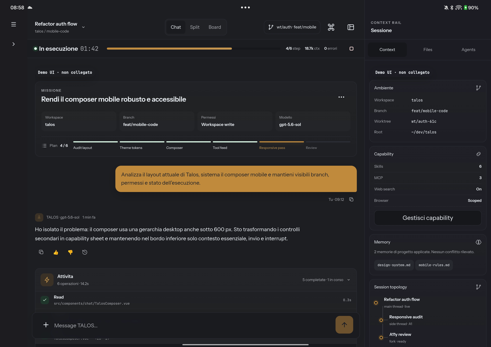

# TALOS Harness Desktop

**A local coding agent that keeps receipts.** A real terminal, review and
diff, automations, hooks, MCP, skills and plugins, driven by any model over
OpenRouter. Every session is a replayable event log; every operation with
side effects leaves a signed receipt. The server binds to `127.0.0.1` only.



## Quick start

Node.js 24 and Google Chrome. No `package.json` for the frontend, no
lockfile, nothing to install there.

**Windows, double-click**: run `harness-ui/scripts/avvia-talos.cmd`. It
starts the server on the first free port from `4174` up, waits for it to
answer, and opens your browser. Nothing to set first: on the first run a
four-step intro asks for what TALOS cannot start without — a provider key
(saved in the OS keyring, never in the browser) or a local engine, a default
model, how much it may do on its own — and then opens the folder picker. It
does not come back once completed or skipped. Set `TALOS_INTRO=0` to disable
it; the launcher then opens the Doctor screen when no access is configured.

**From a terminal**, from the repository root:

```powershell
node harness-ui/server.mjs
```

Open `http://127.0.0.1:4174/` (or the next free port, printed on start; set
`TALOS_HARNESS_UI_PORT` to require an exact one). Set `OPENROUTER_API_KEY` to
start sessions; without it the server still starts, read-only, and starting
a session fails
per request with `CONFIG_INVALID`.

## What you get

- **Chat and tool activity** — streamed events, per-tool approval
  (`allow / ask / deny`), the run's permission shown under the user bubble.
- **Terminal** — a real PTY, not a transcript.
- **Review** — diff of what the session changed, before you accept it.
- **Automations** — scheduled runs with their own history.
- **Six systems** — Library, Notes, Tasks, Memory, Deep Research, Tool Forge.
- **Extensibility** — hooks (sha256-trusted), MCP servers, skills, plugins.
- **Board** — Harness Desktop's own sessions: title, model, and an honest
  three-value status (concluded / interrupted / in progress).
- **Doctor** — a read-only readiness report of the local setup.

Harness UI does not depend on Vue, Vite, npm, or the mobile lane. The
backend (`src/*.mjs`) has its own `package.json` with a few targeted
dependencies, each explained in its header comment.

## Configuration

| Variable | Required | Meaning |
|---|---|---|
| `OPENROUTER_API_KEY` | no | Without it the server starts read-only. |
| `TALOS_HARNESS_UI_HOST` | no | Defaults to `127.0.0.1`; loopback only. |
| `TALOS_HARNESS_UI_PORT` | no | Defaults to `4174`; range `1024..65535`. |
| `TALOS_HARNESS_UI_PROJECT_DIRS` | no | Additional project folders for the session picker, separated by `;`. When absent, the server exposes its own desktop project workspace by default; `Full access` still allows an explicitly chosen folder. |

The rest of the variables (web search, receipt signing, images) are
documented in the header comment of `src/config.mjs`, not duplicated here to
avoid a second copy that drifts out of sync.

### Recommended startup with the Permission Model

This variant lets Node read only Harness UI's own code. It grants no write,
child-process, worker, or addon permissions beyond what the server itself
needs at runtime (the project workspace, `.sessions-store/`,
`.automations/`, the PTY terminal). The loopback bind is still enforced by
the application's own configuration.

```powershell
node --permission `
  --allow-fs-read="$PWD\harness-ui" `
  harness-ui/server.mjs
```

### Windows Explorer development integration

After starting the desktop server, register the per-user development
commands from the repository root:

```powershell
powershell -NoProfile -ExecutionPolicy Bypass `
  -File harness-ui/scripts/windows/register-open-with-talos.ps1
```

Explorer then offers **Apri cartella con TALOS** for a selected directory and
**Apri questa cartella in TALOS** for a directory background. On Windows 11,
this development-only legacy verb can appear under **Show more options**. The
command opens a new-session draft with that directory selected; it does not
silently grant `Full access`. Remove both commands with the same script and
`-Unregister`.

The final installer must own a stable executable and the modern Windows 11
`IExplorerCommand` integration. It must not register a path into a source
checkout. See
`.claude/DOSSIER-RICERCA-OPEN-WITH-TALOS-WINDOWS-2026-09-01.md`.

## Local API

Only `GET`/`HEAD` are available for resources, plus `POST` for session
actions — the complete, up-to-date list lives in `src/http-app.mjs` (the
source code, not duplicated here to avoid a second list that goes stale).
The server does not enable CORS for requests without an `Origin`, and does
not expose directory listings.

## Tests and verification

```powershell
node --test harness-ui/tests/*.test.mjs
```

Chrome verification, with the server already running, in a second
PowerShell:

```powershell
powershell -NoProfile -ExecutionPolicy Bypass `
  -File harness-ui/scripts/qa-chrome.ps1 `
  -BaseUrl 'http://127.0.0.1:4174' `
  -OutputDirectory "$PWD\harness-ui\.artifacts\qa"
```

The script does not start the server. It uses the installed Chrome to
capture the six canonical states: desktop `1440×900`, laptop `1024×800`,
tablet `768×1024`, mobile `390×844`, narrow mobile `320×720`, and
capability `390×844`. Screenshots and `qa-summary.json` are written only to
the given directory, gitignored. For deeper CDP scenarios (multi-step
flows, a real end-to-end session), see `scripts/qa-visual-pipeline.mjs`.

## Intentional limits

- Internal, owner-only tool, in a single Chrome browser.
- No offline support or service worker.
- No blocking WCAG or performance gate in this scope.
- No arbitrary ordering or path supplied freely by the browser beyond what
  "Full access" already accepts explicitly.

## Common problems

- `The local server does not respond`: start Harness UI and reload the page.
- Port already in use: set `TALOS_HARNESS_UI_PORT` to a free loopback port.
- Chrome not found: pass `-ChromePath` to the QA script.

## History notes

Kept here, at the end, so the record stays honest without being the first
thing a reader sees.

- **2026-08-24 — most surfaces were mockup only.** Since then chat, tool
  activity, review/diff, the terminal (a real PTY), automations, doctor, the
  six systems and extensibility have each become real, one at a time, each
  verified live. The phase-by-phase detail is in
  `.claude/elegant-spinning-dongarra.md` (the master plan).
- **2026-08-30 — this tool no longer reads TALOS-BANCO.** Until that date
  the Board tab showed TALOS-BANCO's JSONL campaign data (an external
  measurement tool, separate from the product), an accidental coupling from
  the original integration. Removed entirely: the server never reads its
  directory, never imports its modules. The Board now shows Harness
  Desktop's own sessions.
