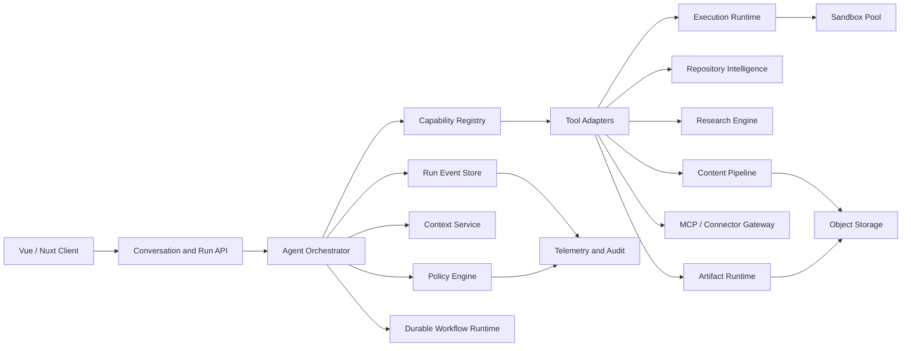
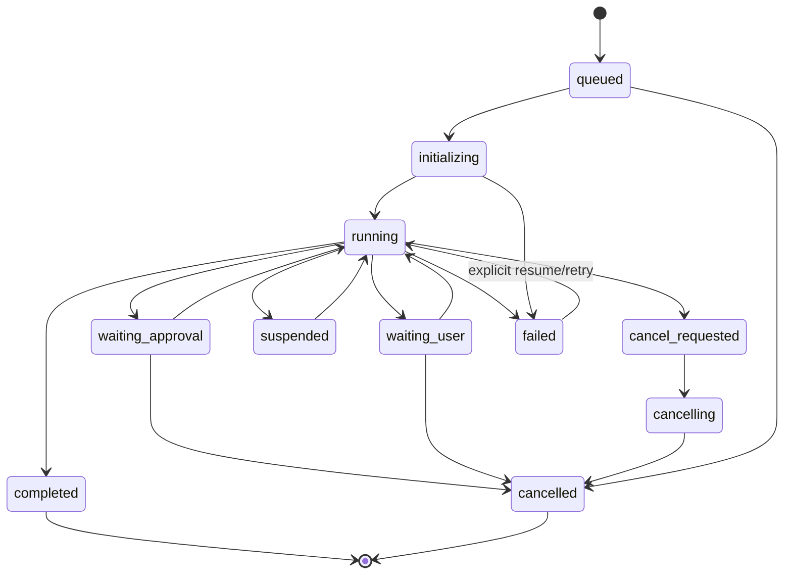
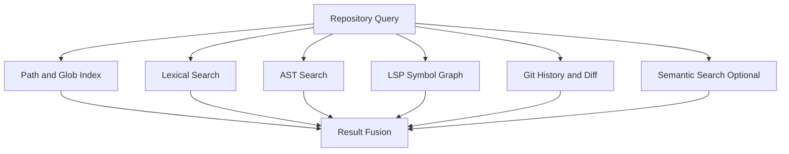

# Proposta di refactor funzionale ispirata a Claude — Specifica tecnica estesa

**Ambito:** coding agent, chat agentica, tool calling, ricerca, generazione di file, contenuti visivi e artefatti  
**Destinatario:** Fable / agente di implementazione  
**Data della ricerca:** 23 luglio 2026  
**Versione:** 2.0 — specifica tecnica estesa  
**Stato:** proposta da adattare al progetto corrente  
**Livello:** architettura, contratti, sicurezza, qualità, repository candidati e piano di adozione

> **Direttiva principale**
>
> Analizzare prima il progetto esistente e adattare queste capacità alla sua architettura, ai suoi utenti, ai suoi vincoli e alle librerie già presenti.
>
> Non introdurre una copia di Claude, non imporre un nuovo stack e non sostituire componenti o servizi stabili senza una motivazione verificabile.

## Novità della versione 2.0

Questa revisione aggiunge:

- inventario aggiornato delle primitive di Claude Code;
- architettura di riferimento a confini espliciti;
- state machine di run, task, tool call, approval e artifact;
- contratti JSON Schema e TypeScript;
- protocollo eventi resumable;
- durable execution, idempotenza, retry e compensazioni;
- editing multi-strategia: exact patch, diff, AST, LSP e three-way merge;
- sandboxing multi-livello e credential broker;
- ricerca web, news e RAG con provenienza a livello di claim;
- pipeline di generazione e verifica per PDF, DOCX, XLSX e PPTX;
- runtime sicuro per artifact statici, AI-powered e connector-powered;
- integrazione funzionale Vue/Nuxt;
- osservabilità OpenTelemetry, metriche, audit e cost governance;
- testing, eval, fuzzing e chaos testing;
- matrici di repository open source candidati;
- criteri `adopt / adapt / retain / reject`, senza scelte arbitrarie.

> Le sezioni tecniche successive sono normative per il comportamento desiderato, ma non impongono linguaggi o prodotti. I nomi delle librerie sono candidati da valutare dopo l'audit.

---

# 1. Obiettivo

Evolvere il prodotto da una semplice interfaccia conversazionale a una piattaforma agentica capace di:

- comprendere e modificare progetti software;
- usare strumenti locali e remoti;
- eseguire attività multi-step;
- lavorare con file, documenti e dati;
- cercare informazioni aggiornate sul web;
- produrre risultati verificabili e citati;
- creare contenuti visuali e artefatti interattivi;
- mantenere controllo, tracciabilità e rollback;
- adattare ogni capacità al contesto e alle autorizzazioni dell'utente.

L'obiettivo non è replicare ogni funzione di Claude, ma usarlo come benchmark funzionale e colmare i punti deboli osservabili.

---

# 2. Lista sintetica delle capacità da valutare

## 2.1 Coding agent

1. Lettura e ricerca nel repository.
2. Modifica mirata dei file.
3. Creazione e sovrascrittura controllata dei file.
4. Editing strutturato dei notebook.
5. Esecuzione di comandi shell.
6. Supporto Bash e PowerShell.
7. Code intelligence tramite Language Server Protocol.
8. Ricerca testuale veloce tramite `ripgrep` o equivalente.
9. Pianificazione prima dell'implementazione.
10. Worktree o workspace isolati.
11. Checkpoint e rollback.
12. Subagent con contesto separato.
13. Task graph e dipendenze.
14. Processi in background e monitoraggio.
15. Hook pre/post azione.
16. Skill riutilizzabili.
17. Plugin.
18. Tool esterni via MCP.
19. Ricerca e lettura web.
20. Produzione e condivisione di report o artefatti.
21. Code review con findings strutturati.
22. Consegna di file generati.
23. Routine e attività pianificate.
24. Notifiche per attività lunghe.

## 2.2 Chat agentica

1. Conversazione testuale.
2. Analisi di immagini.
3. Analisi di documenti e dati caricati.
4. Tool calling.
5. Esecuzione di codice in sandbox.
6. Ricerca web con citazioni.
7. Lettura diretta di URL.
8. Ricerca multi-step.
9. Ricerca su fonti interne collegate.
10. Ricerca di notizie recenti.
11. Ricerca e visualizzazione di immagini dal web.
12. Connettori MCP.
13. Connettori interattivi incorporati nella chat.
14. Creazione e modifica di PDF.
15. Creazione e modifica di Word.
16. Creazione e modifica di Excel.
17. Creazione e modifica di PowerPoint.
18. Analisi dati e visualizzazioni PNG.
19. Diagrammi e grafici interattivi HTML/SVG.
20. Progetti con knowledge base.
21. RAG automatico per basi documentali grandi.
22. Memoria e ricerca nelle conversazioni.
23. Controllo di modello, effort e thinking.
24. Salvataggio dei file su servizi esterni.
25. Computer use o browser automation, se coerente col prodotto.

## 2.3 Artefatti

1. Documento Markdown o testo.
2. Codice.
3. Pagina HTML.
4. SVG.
5. Diagrammi e flowchart.
6. Componente interattivo.
7. Mini-app con capacità AI.
8. Versionamento.
9. Editing iterativo.
10. Pubblicazione o condivisione.
11. Accesso organizzativo.
12. Dati live tramite connettori.
13. Aggiornamento in-place.
14. Esportazione in file.
15. Galleria o libreria.
16. Artefatti generati da una sessione di coding.

---

# 3. Base di ricerca

## 3.1 Claude Code

- Panoramica: <https://code.claude.com/docs/en/overview>
- Riferimento strumenti: <https://code.claude.com/docs/en/tools-reference>
- Comandi: <https://code.claude.com/docs/en/commands>
- MCP: <https://code.claude.com/docs/en/mcp>
- Hook: <https://code.claude.com/docs/en/hooks>
- Artefatti: <https://code.claude.com/docs/en/artifacts>
- Changelog: <https://code.claude.com/docs/en/changelog>
- Mappa documentazione: <https://code.claude.com/docs/en/claude_code_docs_map>

## 3.2 Claude chat e desktop

- Creazione file: <https://support.claude.com/en/articles/12111783-create-and-edit-files-with-claude>
- Ricerca web: <https://support.claude.com/en/articles/10684626-enable-and-use-web-search>
- Research: <https://support.claude.com/en/articles/11088861-use-research-on-claude>
- Connettori: <https://support.claude.com/en/articles/11176164-use-connectors-to-extend-claude-s-capabilities>
- Connettori interattivi: <https://support.claude.com/en/articles/13454812-use-interactive-connectors-in-claude>
- Caricamento file: <https://support.claude.com/en/articles/8241126-upload-files-to-claude>
- Visual personalizzati: <https://support.claude.com/en/articles/13979539-custom-visuals-in-chat-and-cowork>
- Immagini: <https://support.claude.com/en/articles/9002504-can-claude-produce-images>
- Progetti: <https://support.claude.com/en/articles/9517075-what-are-projects>
- RAG: <https://support.claude.com/en/articles/11473015-retrieval-augmented-generation-rag-for-projects>
- Limiti: <https://support.claude.com/en/articles/11647753-how-do-usage-and-length-limits-work>

## 3.3 Artefatti

- Introduzione: <https://support.claude.com/en/articles/9487310-what-are-artifacts-and-how-do-i-use-them>
- Pubblicazione: <https://support.claude.com/en/articles/9547008-publish-and-share-artifacts>
- App AI: <https://claude.com/blog/claude-powered-artifacts>
- Artefatti in Claude Code: <https://claude.com/blog/artifacts-in-claude-code>

---

# 4. Claude Code: analisi funzionale

## 4.1 Modello operativo

Il modello osservabile è un ciclo agentico:

1. raccoglie contesto;
2. pianifica o seleziona un'azione;
3. chiama uno strumento;
4. riceve un risultato strutturato;
5. aggiorna lo stato;
6. ripete fino a completamento, blocco o approvazione.

La parte da replicare non è la sola chat, ma il **runtime di orchestrazione**.

### Proposta

Creare o consolidare un livello `Agent Runtime` separato dalla UI.

Responsabilità:

- registrazione degli strumenti;
- validazione degli input;
- autorizzazioni;
- esecuzione;
- streaming degli eventi;
- retry controllati;
- timeout;
- cancellazione;
- audit;
- persistenza della sessione;
- compensazione e rollback.

---

## 4.2 Lettura e ricerca nel repository

Claude Code usa strumenti distinti per leggere file, trovare file per pattern, cercare contenuto, consultare risorse MCP e leggere immagini, PDF e notebook.

Il suo strumento `Grep` è documentato come basato su `ripgrep`. Il supporto LSP fornisce definizioni, riferimenti, errori e warning.

### Proposta

Introdurre un `Repository Index Layer` con:

- ricerca per filename;
- ricerca testuale;
- ricerca simbolica LSP;
- ricerca semantica opzionale;
- mappa delle dipendenze;
- storico Git;
- ricerca sui file modificati;
- filtri per scope e permessi.

### Miglioramento

Usare un **search planner** che scelga tra glob, grep, AST, LSP, indice semantico e Git diff. Mostrare all'utente quale strategia è stata usata.

---

## 4.3 Editing

Il comportamento documentato distingue:

### `Edit`

- sostituzione mirata;
- confronto esatto tra `old_string` e contenuto corrente;
- controllo di unicità;
- verifica dello stato corrente del file;
- uso per modifiche parziali.

### `Write`

- creazione di un nuovo file;
- sovrascrittura completa;
- nessun append o merge implicito;
- lettura preventiva prima di sovrascrivere un file esistente.

### `NotebookEdit`

- modifica per cella;
- inserimento;
- sostituzione;
- cancellazione.

### Limite

L'editing testuale esatto è sicuro e semplice, ma fragile con formattazione automatica, modifiche concorrenti, grandi refactor, file generati e molte occorrenze simili.

### Proposta

Implementare più strategie:

1. **Exact Patch** — piccole modifiche testuali.
2. **Unified Diff** — modifiche multi-hunk.
3. **AST Edit** — rename, import e trasformazioni strutturali.
4. **LSP Workspace Edit** — refactor supportati dal language server.
5. **Full Rewrite** — solo quando più sicuro della patch.
6. **Notebook Cell Edit** — notebook.
7. **Generated File Pipeline** — file rigenerati dalla fonte.

Ogni modifica deve produrre diff, motivazione, file coinvolti, test, rischio e rollback.

---

## 4.4 Shell ed esecuzione

Claude Code supporta Bash, PowerShell, processi in background e monitoraggio di comandi o WebSocket.

La documentazione indica processi shell separati, timeout, limiti di output, persistenza limitata della directory e variabili d'ambiente non persistenti tra comandi senza configurazione.

### Punti deboli

- stato ambientale non sempre intuitivo;
- risultati lunghi troncati o delegati a file;
- rischio di comandi distruttivi;
- differenze tra sistemi operativi;
- processi background difficili da comprendere.

### Proposta

Creare un `Execution Session` esplicito con:

- shell dichiarata;
- directory corrente visibile;
- variabili persistenti opzionali;
- container o sandbox identificabile;
- elenco processi;
- log strutturati;
- porte esposte;
- health check;
- limiti CPU, memoria, disco e tempo;
- pulsante di stop;
- policy di rete;
- snapshot dell'ambiente;
- manifest riproducibile.

---

## 4.5 Pianificazione, task e subagent

Claude Code offre modalità di pianificazione, task list, subagent con contesto separato, agent team e workflow dinamici.

### Punti deboli

- coordinamento opaco;
- il parent agent riceve spesso solo un riassunto;
- difficile verificare cosa ogni agente abbia letto;
- lavoro duplicato;
- crescita di costi e limiti;
- dipendenze poco leggibili.

### Proposta

Introdurre un `Agent Work Graph` visibile con task, stato, agente, input, strumenti, budget, dipendenze, output, fonti, file modificati, decisioni e blocchi.

Il riassunto del subagent deve essere accompagnato da un manifest verificabile.

---

## 4.6 Permessi, sandbox e controllo

Claude Code usa regole per consentire, negare o richiedere approvazione. MCP amplia il perimetro verso database, API, issue tracker, email e altri sistemi. La documentazione ufficiale avverte del rischio di prompt injection da contenuti esterni.

### Punti deboli

- approval fatigue;
- regole difficili da leggere;
- permessi impliciti o ereditati;
- differenze tra locale, web, desktop e cloud;
- confusione tra lettura e scrittura;
- istruzioni malevole nei contenuti letti.

### Proposta

Creare un `Policy Engine` con:

- scope leggibili;
- separazione tra read, create, update, delete ed execute;
- profili di rischio;
- permessi temporanei;
- permessi per task;
- preview;
- simulazione;
- deny-by-default per dati sensibili;
- provenienza;
- taint tracking;
- conferma per effetti irreversibili;
- audit esportabile;
- policy organizzative versionate.

Livelli proposti:

- `observe`;
- `draft`;
- `safe-write`;
- `execute`;
- `external-write`;
- `destructive`;
- `admin`.

---

## 4.7 Hook, skill, plugin e MCP

- **Hook:** automazione deterministica collegata a eventi.
- **Skill:** istruzioni, script e risorse riutilizzabili.
- **Plugin:** pacchetto distribuibile.
- **MCP:** connessione standardizzata a strumenti e dati.
- **Workflow:** orchestrazione multi-step.

### Proposta

Presentare una sola area `Capabilities`, mantenendo tipi tecnici distinti:

| Tipo | Uso |
|---|---|
| Regola | Vincolo deterministico |
| Hook | Reazione a un evento |
| Skill | Procedura riusabile |
| Tool | Operazione atomica |
| Connector | Accesso a un servizio |
| Workflow | Orchestrazione |
| Agent profile | Ruolo specializzato |
| Plugin | Pacchetto distribuibile |

Ogni elemento deve mostrare autore, versione, permessi, dipendenze, dati accessibili e stato di verifica.

---

## 4.8 Librerie e implementazione osservabile

### Documentato ufficialmente

- `ripgrep` per ricerca testuale;
- LSP per code intelligence;
- Bash e PowerShell;
- MCP;
- HTML e Markdown per artefatti di Claude Code;
- sandbox e strumenti di sistema.

### Pubblicamente osservabile, non contratto ufficiale

Issue e stack trace pubblici indicano:

- React Ink per la terminal UI;
- Yoga per il layout terminale.

Riferimenti:

- <https://github.com/anthropics/claude-code>
- <https://github.com/anthropics/claude-code/issues/3045>
- <https://github.com/anthropics/claude-code/issues/38941>

### Non verificabile pubblicamente

Non risultano documentate completamente:

- tutte le librerie interne per applicare patch;
- tutte le librerie per Word, Excel, PowerPoint e PDF;
- l'intera architettura frontend web/mobile;
- tutti i criteri interni di tool selection;
- prompt di sistema e classificatori.

### Direttiva per Fable

Non copiare Ink, Yoga o altre librerie solo perché osservate in Claude. Valutare stack esistente, compatibilità, accessibilità, prestazioni, manutenzione, testabilità e rollback.

---

# 5. Claude chat: analisi funzionale

## 5.1 Tool calling

Il tool calling trasforma la risposta da testo a sequenza di azioni.

### Requisiti proposti

Ogni tool deve avere:

- nome stabile;
- descrizione;
- schema input;
- schema output;
- errori tipizzati;
- timeout;
- idempotenza dichiarata;
- livello di rischio;
- capability richieste;
- policy di retry;
- compensazione;
- esempi;
- versione.

### Miglioramento

Aggiungere una `Tool Call Timeline` visibile:

- richiesto;
- autorizzato;
- in esecuzione;
- risultato;
- retry;
- fallito;
- annullato;
- compensato.

L'utente deve poter espandere i dettagli senza vedere rumore tecnico per default.

---

## 5.2 Code execution e sandbox

Claude usa un ambiente di calcolo isolato per analisi, script e generazione file. L'accesso di rete dipende dalle impostazioni di egress e possono essere installati pacchetti da package manager approvati.

### Proposta

Separare tre runtime:

1. **Analisi dati**
2. **Generazione documenti**
3. **Esecuzione generica**

Ogni runtime deve avere immagine/versione, dipendenze, rete, mount, limiti, artefatti prodotti, log, durata e hash della configurazione.

### Miglioramento

Rendere il risultato rigenerabile tramite un `run manifest`.

---

## 5.3 File e documenti

Claude può creare:

- `.xlsx`;
- `.pptx`;
- `.docx`;
- `.pdf`;
- script Python;
- visualizzazioni PNG.

La documentazione raccomanda di revisionare e rifinire gli output. Il limite pubblicato è 30 MB per file in upload e download.

### Punto debole

La creazione del file non garantisce automaticamente qualità visiva, correttezza semantica o conformità al brand.

### Proposta: pipeline render-verify-repair

1. pianificare struttura e contenuti;
2. generare il file;
3. aprirlo con un parser nativo;
4. renderizzare una preview;
5. verificare overflow, tagli, font, immagini e formule;
6. eseguire controlli specifici;
7. correggere;
8. rigenerare;
9. consegnare file e report di verifica.

### Controlli per formato

#### PDF

- pagine renderizzabili;
- font incorporati;
- link;
- margini;
- overflow;
- ordine di lettura;
- testo selezionabile;
- metadati;
- accessibilità, quando richiesta.

#### Word

- stili;
- heading;
- indici;
- page break;
- tabelle;
- header/footer;
- immagini;
- commenti o revisioni;
- compatibilità.

#### Excel

- formule;
- riferimenti;
- tipi;
- formattazione;
- filtri;
- freeze pane;
- grafici;
- errori;
- celle nascoste;
- input e output distinti.

#### PowerPoint

- overflow;
- contrasto;
- allineamento;
- coerenza;
- note;
- immagini;
- rapporto d'aspetto;
- font;
- densità.

---

## 5.4 Ricerca web

Claude offre ricerca web con citazioni, lettura URL e risultati immagini. Claude Code distingue `WebSearch`, che restituisce titoli e URL, da `WebFetch`, che estrae contenuto.

La documentazione precisa che `WebFetch` converte la pagina e usa un modello di estrazione: il risultato è quindi **lossy by design**. Le pagine grandi possono essere troncate e la cache può influire sulla freschezza.

### Punti deboli

- perdita di dettagli;
- poca trasparenza sul testo realmente letto;
- pagine dinamiche o protette;
- fonti duplicate;
- confusione tra data di pubblicazione e data dell'evento;
- ricerca generalista usata per notizie;
- citazioni formalmente presenti ma poco pertinenti;
- assenza di garanzia di copertura.

### Proposta

Implementare un `Research Pipeline` con:

- query planner;
- ricerca multiprovider opzionale;
- deduplicazione;
- fetch grezzo e fetch estratto;
- snapshot;
- data di recupero;
- data di pubblicazione;
- data dell'evento;
- autore;
- dominio;
- tipo di fonte;
- score di affidabilità;
- claim-to-source mapping;
- confronto tra fonti;
- citazioni granulari;
- avviso quando una pagina non è stata letta integralmente.

---

## 5.5 News

Claude non documenta un sottosistema universale separato chiamato “News” nella chat standard: le notizie vengono recuperate tramite ricerca web, research e connettori.

### Proposta

Aggiungere una modalità `News Research` con:

- filtro temporale;
- distinzione tra evento e articolo;
- raggruppamento dello stesso evento;
- fonte originale e riprese;
- timeline;
- aggiornamenti;
- correzioni;
- posizioni discordanti;
- stato `developing`, `confirmed`, `corrected`;
- alert su fonti uniche;
- confronto con comunicati ufficiali.

Non mostrare dieci articoli che ripetono lo stesso lancio d'agenzia come dieci conferme indipendenti.

---

## 5.6 Research interno ed esterno

Claude Research può combinare web e fonti connesse, come Gmail, Calendar e Docs.

### Punto debole

La documentazione suggerisce che talvolta l'utente deve chiedere esplicitamente di usare una fonte interna. La selezione automatica del contesto non è sempre prevedibile.

### Proposta

Prima di una ricerca complessa, mostrare un `Research Scope`:

- web;
- progetto;
- email;
- calendario;
- documenti;
- CRM;
- issue tracker;
- repository;
- database.

L'utente può includere, escludere, impostare priorità, limitare il periodo, scegliere read-only e vedere perché una fonte è stata usata.

---

## 5.7 Immagini

Claude può:

- analizzare immagini caricate;
- cercare immagini sul web;
- creare PNG tramite analisi dati;
- creare diagrammi, chart e visual interattivi HTML/SVG.

La documentazione ufficiale corrente dice che Claude non genera fotografie o illustrazioni come un image model dedicato.

### Proposta

Separare chiaramente:

1. `Image Analyze`
2. `Image Search`
3. `Chart Generate`
4. `Diagram Generate`
5. `SVG Generate`
6. `Screenshot Capture`
7. `Image Edit`
8. `Image Synthesis`

Se il prodotto non possiede un image model, supportare provider esterni tramite adapter senza presentare uno SVG come equivalente a una fotografia generata.

---

## 5.8 Visual personalizzati inline

Claude può creare diagrammi, grafici e visual interattivi inline in HTML/SVG. Questi visual sono effimeri per default, anche se possono essere scaricati.

### Punto debole

La distinzione tra visual temporaneo, file, artifact, app e dashboard live non è sempre immediata.

### Proposta

Ogni output visuale deve dichiarare il proprio tipo:

- `Inline visual`
- `Saved artifact`
- `Downloadable file`
- `Live dashboard`
- `Interactive connector app`

Azioni coerenti:

- salva;
- duplica;
- esporta;
- apri nell'editor;
- pubblica;
- collega ai dati;
- converti in file;
- visualizza codice;
- visualizza fonti.

---

## 5.9 Progetti, memoria e RAG

Claude supporta progetti con knowledge base e RAG automatico quando la base supera la finestra di contesto. Il contesto non è necessariamente condiviso tra chat se non viene aggiunto alla knowledge base.

### Punti deboli

- difficile sapere cosa è realmente nel contesto;
- recupero automatico poco spiegabile;
- duplicazione tra memoria, chat, progetto e connettori;
- contenuti obsoleti;
- confusione tra istruzione e fonte;
- possibile perdita di dettagli durante retrieval o compaction.

### Proposta

Creare un `Context Inspector` con:

- istruzioni attive;
- memoria;
- documenti recuperati;
- chat precedenti;
- fonti connesse;
- file del progetto;
- token stimati;
- data di aggiornamento;
- livello di fiducia;
- motivazione del recupero.

Consentire di fissare invarianti, decisioni, fatti da verificare, preferenze e task aperti.

---

# 6. Artefatti: analisi funzionale

## 6.1 Tipi

Gli artefatti Claude comprendono:

- Markdown;
- testo;
- codice;
- HTML;
- SVG;
- diagrammi;
- componenti React interattivi;
- app alimentate da Claude;
- pagine prodotte da sessioni Claude Code.

## 6.2 Lifecycle proposto

1. Bozza in chat.
2. Promozione ad artifact.
3. Editing.
4. Versionamento.
5. Validazione.
6. Pubblicazione.
7. Condivisione.
8. Collegamento a dati.
9. Monitoraggio.
10. Archiviazione o ritiro.

## 6.3 Punti deboli

- artifact e file scaricabile sono concetti differenti ma vicini;
- limiti di storage;
- disponibilità diversa per piano e superficie;
- permessi dei connettori non identici su tutte le superfici;
- dipendenza dall'hosting del provider;
- portabilità non garantita;
- possibile assenza di test;
- una mini-app generata può sembrare pronta alla produzione;
- i visual inline sono effimeri;
- il codice generato può non essere mantenibile.

## 6.4 Artifact Manifest

```yaml
artifact:
  id: string
  type: document | visual | app | dashboard | report
  version: string
  owner: string
  created_at: datetime
  updated_at: datetime
  runtime: string
  source_files: []
  data_sources: []
  connectors: []
  permissions: []
  network_policy: string
  secrets: []
  build_command: string
  test_command: string
  export_formats: []
  retention: string
  provenance: []
```

## 6.5 Modalità

### Static

Nessuna chiamata esterna. Massima portabilità.

### AI-powered

Può invocare un modello attraverso un contratto controllato.

### Connector-powered

Può leggere dati esterni.

### Action-enabled

Può modificare sistemi esterni. Richiede permessi più restrittivi.

### Live session artifact

Aggiornato da una sessione agentica.

## 6.6 Miglioramenti

- esportazione del source bundle;
- modalità offline;
- test automatici;
- accessibility scan;
- dependency scan;
- CSP;
- limiti di rete;
- secret scanner;
- storico azioni;
- preview di ogni write esterno;
- clonazione in un progetto reale;
- separazione preview/production;
- badge “prototype” finché non supera i controlli.

---

# 7. Debolezze principali e contromisure

| Area | Debolezza | Miglioramento |
|---|---|---|
| Editing | Exact string patch fragile | AST/LSP/diff strategy selector |
| Concorrenza | File modificati durante il lavoro | optimistic locking e three-way merge |
| Shell | Stato ambientale implicito | execution session esplicita |
| Output shell | Troncamento e log enormi | log store indicizzato |
| TUI | Problemi pubblici di rendering, scroll e IME | renderer sostituibile e compatibility matrix |
| Tool calling | Sequenza opaca | timeline e audit |
| Permessi | Approval fatigue | profili, scope temporanei e risk scoring |
| MCP | Prompt injection e supply-chain risk | trust registry, sandbox, taint tracking |
| Subagent | Attività invisibile | work graph e manifest |
| Context | Recupero poco spiegabile | context inspector |
| Web fetch | Estrazione lossy | raw snapshot + estrazione verificabile |
| News | Duplicazione e recency ambigua | event clustering e metadata temporali |
| Research | Scope imprevedibile | source scope esplicito |
| Citazioni | Fonte presente ma claim non supportato | claim-level validation |
| PDF | File creato ma non verificato | render-verify-repair |
| Word/PPTX/XLSX | Qualità visiva non garantita | parser + preview + QA specifica |
| Immagini | Nessuna sintesi fotografica nativa | provider adapter |
| Visual inline | Effimeri | promozione esplicita ad artifact |
| Artifact | Prototype percepito come produzione | readiness gate |
| Artifact live | Permessi diversi tra superfici | policy model unificato |
| Piani/superfici | Availability variabile | capability discovery runtime |
| Limiti | Storage, usage e context | chunking, storage esterno, resume |
| Vendor lock-in | Hosting proprietario | export bundle e contratti standard |
| Osservabilità | Costi e retry poco leggibili | telemetry e budget dashboard |
| Error recovery | Fallimento parziale | compensating actions e resume token |

---

# 8. Architettura funzionale proposta

Questa è una separazione di responsabilità, non un'imposizione di framework.

## 8.1 Capability Registry

Registra tool, skill, connector, workflow, artifact runtime, file generator, search provider e image provider.

## 8.2 Agent Orchestrator

Gestisce pianificazione, tool selection, subagent, budget, retry, task graph, stop condition e resume.

## 8.3 Policy Engine

Gestisce identità, ruolo, scope, rischio, approvazioni, policy organizzative e audit.

## 8.4 Execution Runtime

Gestisce sandbox, shell, filesystem, processi, rete, pacchetti, log e file prodotti.

## 8.5 Content Pipeline

Gestisce documenti, fogli, slide, PDF, immagini, parser, renderer e validazione.

## 8.6 Research Engine

Gestisce web search, web fetch, news, fonti interne, deduplica, citazioni, snapshot e freshness.

## 8.7 Artifact Runtime

Gestisce preview, versioni, source, build, dati, connector, export, publish e access control.

## 8.8 Context Service

Gestisce progetto, memoria, retrieval, chat, decisioni e knowledge base.

## 8.9 Observability

Gestisce eventi, durata, token, costi, errori, retry, file, fonti e azioni esterne.

---

# 9. Contratto minimo di uno strumento

```ts
interface ToolDefinition<Input, Output> {
  id: string
  version: string
  description: string
  inputSchema: unknown
  outputSchema: unknown

  risk: "read" | "write" | "execute" | "external-write" | "destructive"
  idempotency: "idempotent" | "conditional" | "non-idempotent"

  capabilities: string[]
  timeoutMs: number
  retryPolicy: RetryPolicy
  permissionPolicy: PermissionPolicy

  preview?: (input: Input, context: ToolContext) => Promise<ToolPreview>
  execute: (input: Input, context: ToolContext) => Promise<ToolResult<Output>>
  compensate?: (
    result: ToolResult<Output>,
    context: ToolContext
  ) => Promise<CompensationResult>
}
```

Il progetto deve adattare il contratto al linguaggio e all'architettura esistenti.

---

# 10. Requisiti UX funzionali

## Prima dell'esecuzione

Mostrare solo quando utile:

- obiettivo;
- scope;
- fonti;
- file coinvolti;
- strumenti;
- rischio;
- costo stimato;
- approvazioni.

## Durante l'esecuzione

Mostrare:

- stato;
- task corrente;
- progressi reali;
- chiamate tool sintetiche;
- richieste di approvazione;
- blocchi;
- possibilità di stop.

Non simulare percentuali se non sono calcolabili.

## Dopo l'esecuzione

Mostrare:

- risultato;
- modifiche;
- file;
- test;
- fonti;
- limiti;
- errori;
- attività incomplete;
- rollback;
- prossima azione.

---

# 11. Roadmap

## P0 — Fondazioni

- capability inventory;
- tool contract;
- event stream;
- policy engine minimo;
- tool timeline;
- sandbox;
- file diff;
- audit;
- stop/cancel;
- error model.

## P1 — Coding agent

- repository search;
- Read/Edit/Write;
- Git diff;
- LSP;
- test runner;
- worktree;
- checkpoint;
- background process;
- task graph.

## P2 — Ricerca e connettori

- web search;
- fetch;
- citazioni;
- MCP;
- connector permissions;
- research scope;
- provenance.

## P3 — Generazione file

- PDF;
- DOCX;
- XLSX;
- PPTX;
- render-verify-repair;
- download;
- storage.

## P4 — Visual e artifact

- HTML/SVG;
- artifact editor;
- versioning;
- publish;
- export;
- source bundle;
- access control.

## P5 — Agent avanzati

- subagent;
- workflow;
- scheduling;
- monitor;
- notifications;
- live artifact;
- connector-powered artifact.

## P6 — Differenziazione

- news mode;
- AST refactor;
- claim citation validator;
- taint tracking;
- artifact production gate;
- multi-provider image generation;
- workflow portabili.

---

# 12. Metriche

## Affidabilità

- tool call success rate;
- retry rate;
- rollback rate;
- merge conflict rate;
- test pass rate;
- document validation rate.

## Sicurezza

- permessi negati;
- azioni distruttive evitate;
- prompt injection rilevate;
- scope escalation;
- secret exposure.

## Qualità

- modifiche accettate;
- revisioni manuali;
- errori visuali;
- citazioni non supportate;
- artifact promossi in produzione.

## Efficienza

- tempo al primo risultato;
- tempo a completamento;
- token;
- costo;
- chiamate tool;
- duplicazione tra agenti;
- cache hit.

## UX

- approval frequency;
- task abbandonati;
- error recovery;
- comprensione del risultato;
- uso del rollback;
- uso delle fonti.

---

# 13. Acceptance criteria

La prima versione è accettabile solo se:

- le capacità esistenti non regrediscono;
- ogni tool ha schema e rischio;
- le azioni in scrittura sono tracciate;
- l'utente può annullare attività lunghe;
- ogni modifica di codice produce un diff;
- i file generati vengono verificati;
- le citazioni sono collegate ai claim;
- ricerca e connettori mostrano la provenienza;
- i permessi sono coerenti tra superfici;
- gli artifact hanno versioni e ownership;
- gli artifact con azioni esterne dichiarano i permessi;
- errori parziali non vengono presentati come successo totale;
- il prodotto scopre a runtime le capability disponibili;
- ogni nuova libreria o servizio è giustificato.

---

# 14. Prima risposta richiesta a Fable

Prima di implementare, Fable deve restituire:

1. inventario delle funzionalità esistenti;
2. architettura corrente di chat, tool e file;
3. librerie e servizi già presenti;
4. capability già implementate;
5. gap rispetto alla proposta;
6. rischi;
7. dipendenze;
8. aree da non modificare;
9. proposta incrementale;
10. primo slice reversibile;
11. decisione motivata tra riuso, modifica, estensione, sostituzione o nuova implementazione.

---

# 15. Regole contro decisioni arbitrarie

Fable non deve decidere senza evidenza:

- framework;
- database;
- queue;
- vector store;
- search provider;
- sandbox provider;
- file-generation library;
- image provider;
- MCP SDK;
- artifact runtime;
- design system;
- schema di persistenza;
- strategia di deployment.

Per ogni scelta deve indicare:

- cosa esiste;
- problema;
- alternative;
- compatibilità;
- rischio;
- costo;
- lock-in;
- rollout;
- rollback.

---

# 16. Raccomandazione finale

La caratteristica più importante da prendere da Claude non è un singolo tool.

È la separazione tra:

- ragionamento agentico;
- strumenti;
- permessi;
- runtime;
- contesto;
- output;
- artefatti;
- collaborazione.

Il miglioramento principale rispetto a Claude dovrebbe essere la **trasparenza operativa**:

- cosa sta facendo;
- perché;
- con quali dati;
- con quali permessi;
- quanto costa;
- cosa ha modificato;
- come si verifica;
- come si annulla;
- come si esporta.

---

# 17. Specifica normativa e criteri di conformità

## 17.1 Linguaggio normativo

Nel resto del documento:

- **MUST / DEVE** indica un requisito necessario per sicurezza, correttezza o interoperabilità;
- **MUST NOT / NON DEVE** indica un comportamento proibito;
- **SHOULD / DOVREBBE** indica la scelta raccomandata, derogabile solo con una motivazione documentata;
- **MAY / PUÒ** indica una capacità opzionale;
- **candidate** indica una tecnologia da valutare, non una dipendenza già approvata;
- **adapter** indica il confine che impedisce al dominio di dipendere direttamente da un provider.

## 17.2 Principi non negoziabili

1. Il frontend NON DEVE conoscere gli SDK dei provider modello o dei connector.
2. Le azioni con side effect DEVONO passare dal Policy Engine.
3. La chat NON DEVE essere la fonte autorevole dello stato operativo.
4. Goal, vincoli, task, approval, tool call, file mutation e artifact DEVONO avere stato persistente indipendente dal testo della conversazione.
5. Ogni write DEVE essere attribuibile a utente, run, step, tool, versione e policy decision.
6. Ogni tool input e output DEVE essere validato a runtime.
7. Un risultato parziale NON DEVE essere rappresentato come successo totale.
8. Ogni retry di un side effect DEVE rispettare l'idempotenza dichiarata.
9. I contenuti recuperati da web, repository, documenti e connector DEVONO essere trattati come dati non attendibili, non come istruzioni privilegiate.
10. Il runtime DEVE supportare cancellation cooperativa e, per processi isolati, terminazione forzata.
11. Ogni artifact eseguibile DEVE essere isolato dal dominio applicativo principale.
12. Ogni nuova dipendenza DEVE superare una decisione `retain / adapt / adopt / reject`.

## 17.3 Decision record obbligatorio

Ogni tecnologia candidata deve avere un ADR contenente almeno:

```yaml
adr:
  id: ADR-XXXX
  title: string
  status: proposed | accepted | rejected | superseded
  context: string
  current_solution: string
  problem: string
  options:
    - name: string
      benefits: []
      costs: []
      risks: []
      compatibility: []
      license: string
      maintenance_signal: string
  decision: string
  consequences: []
  rollout: []
  rollback: []
  evidence: []
  owner: string
  reviewed_at: datetime
```

Una valutazione basata solo su popolarità, estetica o numero di stelle NON è sufficiente.

---

# 18. Baseline funzionale Claude aggiornata

## 18.1 Mappatura delle primitive Claude Code

La documentazione corrente espone primitive che conviene normalizzare in capability interne, anziché copiarne i nomi nel dominio.

| Primitive Claude Code | Responsabilità osservabile | Capability interna proposta |
|---|---|---|
| `Agent` | subagent con contesto separato | `agent.spawn` |
| `Artifact` | pubblicazione HTML/Markdown | `artifact.publish` |
| `AskUserQuestion` | elicitation strutturata | `interaction.request_input` |
| `Bash`, `PowerShell` | esecuzione shell | `execution.command` |
| `CronCreate`, `CronDelete`, `CronList` | schedule di sessione | `scheduler.session_job.*` |
| `RemoteTrigger`, `ScheduleWakeup` | routine e loop remoti | `scheduler.remote.*` |
| `Edit`, `Write`, `NotebookEdit` | mutazione workspace | `workspace.mutate.*` |
| `EnterPlanMode`, `ExitPlanMode` | separazione plan/execute | `run.plan.*` |
| `EnterWorktree`, `ExitWorktree` | isolamento Git | `workspace.isolation.*` |
| `Glob`, `Grep`, `Read`, `LSP` | contesto repository | `repository.query.*` |
| `ListMcpResourcesTool`, `ReadMcpResourceTool` | risorse MCP | `connector.resource.*` |
| `Monitor` | processi/event source | `execution.monitor` |
| `PushNotification` | notifiche utente | `notification.send` |
| `ReportFindings` | findings strutturati | `review.finding.report` |
| `SendMessage` | coordinamento agenti | `agent.message.send` |
| `SendUserFile` | consegna file | `delivery.file.send` |
| `Skill` | procedura riutilizzabile | `capability.skill.execute` |
| `TaskCreate/Get/List/Update/Stop` | task graph | `task.*` |
| `ToolSearch`, `WaitForMcpServers` | discovery differita | `capability.discover` |
| `WebSearch`, `WebFetch` | ricerca e acquisizione | `research.*` |
| `Workflow` | orchestrazione multi-agent | `workflow.execute` |

## 18.2 Comportamenti tecnici da preservare come benchmark

- `Grep` usa `ripgrep` e restituisce modalità distinte per path, contenuto e conteggio.
- `Edit` applica una sostituzione testuale esatta con precondizioni di lettura, match e unicità.
- `LSP` fornisce definizioni, riferimenti, warning ed errori.
- i subagent lavorano in un context window separato;
- worktree e checkpoint riducono il rischio delle modifiche;
- tool e subagent possono avere allowlist e denylist;
- i processi lunghi possono essere monitorati in background;
- gli strumenti possono essere caricati in modo differito;
- gli output strutturati possono essere validati contro JSON Schema;
- hook ed eventi rendono osservabile il lifecycle.

## 18.3 Limiti da non ereditare

- editing exact-string come unica strategia;
- stato operativo dipendente dalla conversazione;
- subagent intermedi poco osservabili;
- output shell troncato senza un log store interrogabile;
- scope di ricerca non sempre esplicito;
- artifact percepibili come production-ready senza gate;
- permessi frammentati tra superfici;
- contesto e compaction non completamente ispezionabili;
- visual inline, file e artifact con lifecycle non uniforme.

---

# 19. Architettura target a confini espliciti

## 19.1 Componenti logici



## 19.2 Boundaries

### Conversation API

Responsabile di messaggi, allegati e presentazione. NON esegue direttamente tool.

### Run API

Crea, osserva, sospende, riprende, annulla e biforca run.

### Agent Orchestrator

Interpreta il piano, seleziona capability, mantiene il task graph e applica stop condition e budget.

### Durable Workflow Runtime

Rende recuperabili attività lunghe e side effect. Può essere implementato con l'infrastruttura esistente; Temporal è candidato solo quando durability, timer, retry e resume giustificano il costo operativo.

### Capability Registry

Contiene metadata e versioni di tool, skill, connector, workflow, model provider e artifact runtime.

### Policy Engine

Decide se una capability è visibile, permessa, soggetta ad approvazione o vietata.

### Context Service

Costruisce il contesto senza confondere policy, memoria, istruzioni e prove recuperate.

### Execution Runtime

Gestisce shell, processi, filesystem temporaneo, rete, limiti e snapshot.

### Research Engine

Gestisce query, fetch, browser, parsing, deduplica, freshness e provenienza.

### Content Pipeline

Genera e verifica file documentali e visuali.

### Artifact Runtime

Compila, esegue, versiona, pubblica ed esporta artifact isolati.

### Event Store e Audit

L'Event Store ricostruisce lo stato del run. L'Audit Log conserva decisioni e side effect con retention e access control distinti dalla telemetria.

## 19.3 Provider isolation

Il dominio deve dipendere da interfacce, non da SDK specifici:

```ts
interface ModelProvider {
  id: string
  capabilities(): Promise<ModelCapabilities>
  stream(request: ModelRequest, signal: AbortSignal): AsyncIterable<ModelEvent>
  countTokens?(request: TokenCountRequest): Promise<TokenCountResult>
}

interface SearchProvider {
  search(request: SearchRequest, signal: AbortSignal): Promise<SearchResultPage>
}

interface SandboxProvider {
  create(spec: SandboxSpec): Promise<SandboxHandle>
}

interface ObjectStore {
  put(stream: ReadableStream, metadata: ObjectMetadata): Promise<ObjectRef>
  get(ref: ObjectRef): Promise<ReadableStream>
}
```

Gli eventi provider-specific devono essere normalizzati prima di raggiungere il frontend.

---

# 20. Modello di dominio e state machine

## 20.1 Entità fondamentali

- `Conversation`: contenitore editoriale dei messaggi.
- `Run`: esecuzione agentica associata a un obiettivo.
- `RunContract`: obiettivo, vincoli, acceptance criteria e budget autorevoli.
- `Task`: unità pianificata nel work graph.
- `Step`: tentativo eseguibile di un task.
- `ToolDefinition`: contratto versionato di una capability atomica.
- `ToolInvocation`: richiesta concreta di esecuzione.
- `Approval`: decisione umana o di policy.
- `WorkspaceSnapshot`: stato riproducibile del workspace.
- `ContextItem`: unità di contesto con provenienza.
- `Citation`: relazione tra claim e fonte.
- `Artifact`: oggetto versionato e potenzialmente eseguibile.
- `GeneratedFile`: file con manifest di produzione e verifica.
- `AuditRecord`: registrazione immutabile di una decisione o side effect.

## 20.2 Run state machine



Stati minimi:

```ts
type RunStatus =
  | "queued"
  | "initializing"
  | "running"
  | "waiting_approval"
  | "waiting_user"
  | "suspended"
  | "cancel_requested"
  | "cancelling"
  | "completed"
  | "failed"
  | "cancelled"
  | "expired"
  | "orphaned"
```

Regole:

- `completed` richiede acceptance criteria valutati o marcati `not_applicable` con motivazione;
- `failed` deve includere un errore tipizzato e indicare se il run è resumable;
- `cancel_requested` non equivale a `cancelled`;
- `orphaned` indica perdita del worker senza lease valido;
- un resume crea un nuovo `attempt_id`, ma conserva `run_id` e storia.

## 20.3 Task e step

```ts
type TaskStatus =
  | "proposed"
  | "ready"
  | "blocked"
  | "running"
  | "succeeded"
  | "failed"
  | "skipped"
  | "cancelled"

type StepStatus =
  | "planned"
  | "scheduled"
  | "running"
  | "succeeded"
  | "failed"
  | "compensating"
  | "compensated"
  | "cancelled"
```

Ogni task deve dichiarare:

- dipendenze;
- owner agent;
- input refs;
- expected outputs;
- capability allowlist;
- budget tempo/token/costo;
- verification strategy;
- side-effect class;
- retry policy.

## 20.4 Approval state machine

```ts
type ApprovalStatus =
  | "requested"
  | "approved_once"
  | "approved_for_scope"
  | "denied"
  | "expired"
  | "revoked"
  | "superseded"
```

Un'approvazione deve legarsi a:

- hash canonico dell'input;
- versione del tool;
- subject e tenant;
- scope;
- durata;
- risk level;
- eventuali limiti quantitativi.

Una modifica dell'input invalida l'approvazione salvo policy esplicita.

## 20.5 Artifact state machine

```ts
type ArtifactStatus =
  | "draft"
  | "building"
  | "build_failed"
  | "preview_ready"
  | "verification_failed"
  | "verified"
  | "published"
  | "deprecated"
  | "archived"
```

`published` deve puntare a una versione immutabile. Un alias come `latest` può essere mutabile, ma non deve sostituire la versione storica.

---

# 21. Protocollo eventi, API e streaming

## 21.1 Scelta del trasporto

- **SSE** è il default raccomandato per stream server-to-client ordinati: token, eventi run, progressi, tool status e notifiche.
- **WebSocket** è raccomandato per terminali interattivi, input bidirezionale ad alta frequenza, presenza multiutente e monitor live.
- Polling è fallback, non protocollo primario per attività lunghe.
- Il dominio deve usare lo stesso envelope indipendentemente dal trasporto.

## 21.2 Event envelope

Adottare un envelope compatibile con CloudEvents o semanticamente equivalente:

```ts
interface RunEvent<T = unknown> {
  specversion: "1.0"
  id: string
  source: string
  type: string
  subject: string
  time: string
  datacontenttype: "application/json"

  tenant_id: string
  conversation_id: string
  run_id: string
  attempt_id: string
  sequence: number
  correlation_id: string
  causation_id?: string
  trace_id?: string

  schema_version: string
  data: T
}
```

Proprietà:

- `sequence` è monotona per `run_id`;
- `id` è globalmente unico;
- gli eventi possono essere consegnati almeno una volta;
- il consumer deve deduplicare per `id`;
- `Last-Event-ID` o cursore equivalente consente resume;
- gap di sequenza obbligano il client a richiedere backfill;
- eventi sconosciuti devono essere ignorati in modo forward-compatible e loggati.

## 21.3 Event taxonomy

```text
run.created
run.started
run.suspended
run.resumed
run.cancel_requested
run.completed
run.failed

plan.created
plan.updated

task.created
task.blocked
task.started
task.completed
task.failed

tool.requested
tool.approval_required
tool.started
tool.progress
tool.output_chunk
tool.completed
tool.failed
tool.compensation_started
tool.compensated

context.retrieved
context.rejected
citation.created

workspace.checkpoint_created
workspace.diff_created
workspace.conflict_detected

artifact.build_started
artifact.preview_ready
artifact.verified
artifact.published

usage.updated
policy.decision
notification.created
```

## 21.4 Snapshot e reducer

Il frontend deve ricostruire la UI con un reducer puro:

```ts
interface RunSnapshot {
  run: RunView
  tasks: Record<string, TaskView>
  toolCalls: Record<string, ToolCallView>
  approvals: Record<string, ApprovalView>
  artifacts: Record<string, ArtifactView>
  usage: UsageView
  lastSequence: number
}

function reduceRunEvent(state: RunSnapshot, event: RunEvent): RunSnapshot
```

Il server dovrebbe creare snapshot periodici per evitare il replay di milioni di eventi. Lo snapshot deve contenere `last_sequence` e checksum.

## 21.5 API contracts

- REST/HTTP: OpenAPI 3.1 o contratto equivalente.
- Event stream: AsyncAPI 3 o contratto equivalente.
- Schemi dati: JSON Schema 2020-12.
- Errori HTTP: RFC 9457 `application/problem+json`.
- Event envelope: CloudEvents 1.0.

Esempio errore:

```json
{
  "type": "https://example.invalid/problems/tool-policy-denied",
  "title": "Tool invocation denied by policy",
  "status": 403,
  "detail": "The requested filesystem scope is outside the approved workspace.",
  "instance": "/runs/run_123/tool-calls/tc_456",
  "code": "TOOL_POLICY_DENIED",
  "retryable": false,
  "correlation_id": "corr_789"
}
```

## 21.6 Concurrency control

Ogni mutation API deve supportare almeno uno tra:

- `If-Match` con ETag;
- `expected_version`;
- compare-and-swap;
- idempotency key.

Il client NON deve applicare optimistic updates per side effect esterni irreversibili. Può mostrare uno stato `pending` finché l'evento autorevole non arriva.

---

# 22. Contratto tool v2

## 22.1 Obiettivo

Il tool contract deve rendere espliciti dati, effetti, rischio, autorizzazioni, retry, verifica e compensazione. La sola coppia `name + JSON schema` non è sufficiente per un sistema affidabile.

## 22.2 Definizione canonica

```ts
type RiskClass =
  | "observe"
  | "local_write"
  | "execute"
  | "external_write"
  | "destructive"
  | "privileged"

type IdempotencyClass =
  | "idempotent"
  | "idempotent_with_key"
  | "conditionally_idempotent"
  | "non_idempotent"

type DataClassification =
  | "public"
  | "internal"
  | "confidential"
  | "restricted"

interface ToolDefinition {
  id: string                    // fully qualified, e.g. github.issue.create
  version: string               // immutable semantic version or content hash
  displayName: string
  description: string
  provider: string
  namespace: string

  inputSchema: JsonSchema202012
  outputSchema: JsonSchema202012
  progressSchema?: JsonSchema202012

  risk: RiskClass
  idempotency: IdempotencyClass
  sideEffects: string[]
  dataClassifications: DataClassification[]
  requiredCapabilities: string[]

  filesystem?: FilesystemPolicy
  network?: NetworkPolicy
  secrets?: SecretRequirement[]
  resourceLimits?: ResourceLimits

  timeoutMs: number
  maxOutputBytes: number
  retryPolicy: RetryPolicy
  approvalPolicy: ApprovalPolicy

  supportsPreview: boolean
  supportsCancellation: boolean
  supportsVerification: boolean
  supportsCompensation: boolean

  deprecation?: DeprecationInfo
  source?: RepositoryRef
  documentationUrl?: string
  schemaHash: string
}
```

## 22.3 Lifecycle

```ts
interface ToolAdapter<I, O> {
  describe(): ToolDefinition

  preflight(
    input: I,
    ctx: ToolContext
  ): Promise<PreflightResult>

  preview?(
    input: I,
    ctx: ToolContext
  ): Promise<ToolPreview>

  execute(
    input: I,
    ctx: ToolContext,
    signal: AbortSignal
  ): Promise<ToolExecution<O>>

  verify?(
    execution: ToolExecution<O>,
    ctx: ToolContext
  ): Promise<VerificationResult>

  compensate?(
    execution: ToolExecution<O>,
    ctx: ToolContext
  ): Promise<CompensationResult>
}
```

Ordine obbligatorio:

1. schema validation;
2. policy evaluation;
3. preflight;
4. approval, quando necessaria;
5. execution;
6. output validation;
7. verification;
8. audit;
9. compensation se il workflow fallisce e la policy la richiede.

## 22.4 Validazione

- Validare input sia prima dell'invio al modello sia prima dell'esecuzione.
- Validare output del tool prima di inserirlo nel contesto.
- Non correggere silenziosamente input distruttivi.
- Coercion automatica consentita solo per tipi innocui e dichiarati.
- Limitare profondità, numero proprietà, lunghezza array e dimensione stringhe per prevenire schema bombs.
- Conservare separatamente `raw_output` e `validated_output`.
- Versionare gli schemi; una breaking change richiede una nuova major o un nuovo tool ID.

Candidati TypeScript:

- JSON Schema runtime: <https://github.com/ajv-validator/ajv>
- schema TypeScript-first: <https://github.com/colinhacks/zod>

Raccomandazione:

- JSON Schema è il contratto esterno e cross-language;
- Zod può essere usato internamente in TypeScript;
- Ajv è preferibile al boundary quando il contratto autorevole è JSON Schema;
- evitare due schemi scritti a mano che possono divergere.

## 22.5 Idempotenza

### Read

Può essere ritentato automaticamente se il provider dichiara coerenza sufficiente.

### Write idempotente con chiave

Deve includere una `idempotency_key` stabile per il tentativo logico. Il retry riutilizza la stessa chiave.

### Write condizionale

Deve includere una precondizione, per esempio ETag, version, object hash o expected status.

### Non idempotente

Non deve essere ritentato automaticamente dopo un timeout ambiguo. Prima verificare se l'effetto è avvenuto oppure richiedere decisione umana.

## 22.6 Retry policy

```ts
interface RetryPolicy {
  maxAttempts: number
  maxElapsedMs: number
  initialDelayMs: number
  maxDelayMs: number
  multiplier: number
  jitter: "full" | "equal" | "decorrelated"
  retryableCodes: string[]
  nonRetryableCodes: string[]
}
```

Best practice:

- exponential backoff con jitter;
- rispettare `Retry-After`;
- budget globale del run oltre al budget del tool;
- circuit breaker per dipendenze degradate;
- niente retry annidati non coordinati tra SDK, worker e orchestrator;
- registrare `attempt_number` e `previous_error_code`.

## 22.7 Error taxonomy

```ts
type ToolErrorCode =
  | "INPUT_INVALID"
  | "OUTPUT_INVALID"
  | "AUTH_REQUIRED"
  | "AUTH_EXPIRED"
  | "PERMISSION_DENIED"
  | "POLICY_DENIED"
  | "APPROVAL_EXPIRED"
  | "NOT_FOUND"
  | "CONFLICT"
  | "RATE_LIMITED"
  | "TIMEOUT"
  | "DEPENDENCY_UNAVAILABLE"
  | "SANDBOX_VIOLATION"
  | "NETWORK_DENIED"
  | "RESOURCE_EXHAUSTED"
  | "CANCELLED"
  | "COMPENSATION_FAILED"
  | "UNKNOWN"
```

Ogni errore deve dichiarare:

- `retryable`;
- `safe_to_show`;
- `user_action_required`;
- `side_effect_may_have_occurred`;
- `provider_code` separato dal codice normalizzato.

## 22.8 Tool discovery differita

Per registri grandi:

1. esporre al modello solo metadata sintetici;
2. ricercare capability per intento;
3. caricare lo schema completo solo quando necessario;
4. usare nomi fully-qualified;
5. hashare descrizione e schema;
6. richiedere nuova approvazione se un server cambia una capability sensibile;
7. impedire tool shadowing tra connector.

Esempio ID:

```text
mcp.github@2026-07/issues.create#sha256:...
```

---

# 23. Orchestrazione, durable execution e multi-agent

## 23.1 Run contract autorevole

Il run deve iniziare con un contratto persistente:

```ts
interface RunContract {
  goal: string
  constraints: Constraint[]
  nonGoals: string[]
  acceptanceCriteria: AcceptanceCriterion[]
  allowedDataScopes: DataScope[]
  maxDurationMs?: number
  maxCost?: Money
  maxModelTokens?: number
  maxToolCalls?: number
  executionMode: "draft" | "supervised" | "autonomous"
  requiredApprovals: ApprovalRule[]
  verificationPlan: VerificationPlan
  version: number
}
```

Il modello può proporre modifiche al contratto, ma non cambiarlo implicitamente.

## 23.2 Plan model

```ts
interface Plan {
  id: string
  runId: string
  version: number
  assumptions: Assumption[]
  tasks: PlannedTask[]
  criticalPath: string[]
  risks: Risk[]
  verificationSteps: VerificationStep[]
  rollbackPlan: RollbackStep[]
}
```

Un piano non deve diventare un vincolo rigido: può essere rivisto quando emergono nuove prove. Ogni revisione deve registrare la motivazione.

## 23.3 Durable execution

Un run è durable quando può sopravvivere a:

- restart del worker;
- perdita della connessione client;
- timeout provider;
- approval ritardata;
- task pianificati nel futuro;
- callback esterne;
- fallimento parziale.

### Implementazione minima

Se il progetto ha già queue e database affidabili:

- tabella run/task/step;
- lease con heartbeat;
- outbox transazionale;
- inbox deduplication;
- scheduler;
- retry state persistito;
- compensation state;
- object storage per payload grandi.

### Quando valutare Temporal

Repository: <https://github.com/temporalio/sdk-typescript>

Adottarlo solo se sono realmente necessari:

- workflow di ore o giorni;
- timer durabili;
- resume trasparente;
- molti side effect con retry;
- signal/query;
- cron;
- compensazioni complesse;
- replay deterministico.

Non introdurlo per semplici richieste sincrone o job brevi già ben gestiti dall'infrastruttura esistente.

## 23.4 Outbox e inbox

### Outbox

La modifica dello stato e la pubblicazione dell'evento devono avvenire nella stessa transazione logica. Un relay pubblica successivamente l'evento.

### Inbox

Ogni consumer registra gli event ID già processati. La ripetizione dello stesso evento non deve duplicare side effect.

## 23.5 Lease e orphan recovery

Ogni step in esecuzione ha:

- `worker_id`;
- `lease_expires_at`;
- `heartbeat_at`;
- `attempt`;
- `fencing_token`.

Un nuovo worker può acquisire lo step solo con un fencing token superiore. I vecchi worker devono essere incapaci di committare dopo la perdita del lease.

## 23.6 Subagent isolation

Ogni subagent deve avere:

- context budget indipendente;
- tool allowlist;
- data scope;
- filesystem scope;
- network scope;
- cost budget;
- max turns;
- stop condition;
- output schema;
- manifest delle fonti e azioni.

Il parent riceve:

```ts
interface SubagentResult {
  summary: string
  status: "completed" | "partial" | "failed" | "cancelled"
  findings: Finding[]
  sourceRefs: SourceRef[]
  toolInvocationIds: string[]
  changedFiles: FileChangeRef[]
  unresolvedQuestions: string[]
  verification: VerificationResult[]
  usage: Usage
}
```

Non è necessario esporre ragionamenti interni; è necessario esporre prove, azioni e limiti.

## 23.7 Parallelismo

Parallelizzare solo task che:

- non modificano gli stessi file o record;
- non dipendono dallo stesso side effect non idempotente;
- hanno output composabili;
- non superano budget e rate limit;
- possono essere riconciliati deterministicamente.

Usare lock logici o ownership per file/risorsa. In caso di conflitto, sospendere e riconciliare; non applicare last-write-wins su codice o decisioni.

## 23.8 Compaction-safe state

Goal, policy, acceptance criteria, decisioni e task non devono vivere solo nel prompt. Prima e dopo una compaction:

1. creare un summary strutturato;
2. salvarlo come stato autorevole;
3. calcolare checksum;
4. reidratare invarianti e task aperti;
5. verificare che non siano stati persi vincoli critici.

---

# 24. Context service, memoria e retrieval

## 24.1 Separazione dei livelli

Il context builder deve comporre sezioni separate:

1. system policy;
2. organization policy;
3. run contract;
4. user instructions;
5. verified project facts;
6. selected conversation history;
7. retrieved evidence;
8. tool outputs;
9. transient working notes.

Il contenuto recuperato NON deve poter promuovere se stesso a policy o istruzione.

## 24.2 Context item

```ts
interface ContextItem {
  id: string
  kind:
    | "policy"
    | "instruction"
    | "memory"
    | "repository"
    | "document"
    | "web"
    | "connector"
    | "tool_output"
  contentRef: ObjectRef
  excerpt?: string
  sourceUri?: string
  sourceVersion?: string
  retrievedAt: string
  publishedAt?: string
  eventAt?: string
  freshness?: "live" | "fresh" | "stale" | "unknown"
  trust: "trusted" | "organization" | "external" | "untrusted"
  dataClassification: DataClassification
  instructionBearing: boolean
  tokenCount: number
  score?: number
  reasonSelected: string
  hash: string
}
```

Per default, `instructionBearing` deve essere `false` per web, allegati, connector e repository.

## 24.3 Retrieval pipeline

Pipeline raccomandata:

1. query decomposition;
2. metadata filtering;
3. lexical retrieval;
4. dense retrieval opzionale;
5. reciprocal rank fusion;
6. reranking;
7. diversity selection;
8. chunk expansion;
9. freshness and authority weighting;
10. citation span extraction.

Non introdurre un vector database senza misurare un miglioramento rispetto a full-text search e filtri esistenti.

## 24.4 Candidate retrieval stores

- PostgreSQL esistente + `pgvector`: <https://github.com/pgvector/pgvector>
- dedicated vector store: <https://github.com/qdrant/qdrant>
- embedded/local: <https://github.com/asg017/sqlite-vec> — verificare maturità pre-1.0;
- full-text library Rust: <https://github.com/quickwit-oss/tantivy>
- search service developer-friendly: <https://github.com/meilisearch/meilisearch>

Criterio:

- riusare il datastore esistente quando soddisfa recall, filtri e latenza;
- evitare duplicazione di dati se non necessaria;
- conservare sempre il riferimento alla fonte canonica;
- supportare delete e retention end-to-end.

## 24.5 Chunking

Non usare una lunghezza fissa universale.

Strategie:

- codice: funzione, classe, modulo e dipendenze;
- Markdown: heading tree;
- PDF: blocchi di layout e pagina;
- DOCX: paragrafo, heading e tabella;
- email: thread e messaggio;
- issue: descrizione, commenti, eventi;
- fogli: tabella, range nominato, foglio e formule.

Ogni chunk deve conservare parent, posizione, checksum e ACL.

## 24.6 Context inspector

La UI deve mostrare:

- elementi attivi;
- origine;
- motivazione del recupero;
- data;
- trust;
- dimensione;
- eventuale stale warning;
- possibilità di escludere o fissare;
- elementi scartati, su richiesta.

## 24.7 Memory policy

Distinguere:

- **preference memory**: preferenze reversibili dell'utente;
- **project memory**: decisioni condivise e versionate;
- **run memory**: fatti temporanei;
- **ephemeral scratch**: non persistente;
- **regulated data**: retention e consenso specifici.

Mai salvare automaticamente segreti, token, credenziali, dati sanitari o altri dati altamente sensibili come memoria generale.

---

# 25. Repository intelligence ed editing engine

## 25.1 Layer di intelligence



## 25.2 Repository candidati

- fast text search: <https://github.com/BurntSushi/ripgrep>
- incremental parsing: <https://github.com/tree-sitter/tree-sitter>
- structural search/replace: <https://github.com/ast-grep/ast-grep>
- TypeScript AST manipulation: <https://github.com/dsherret/ts-morph>
- codemod JavaScript/TypeScript: <https://github.com/facebook/jscodeshift>
- format-preserving AST printing: <https://github.com/benjamn/recast>
- LSP specification: <https://github.com/microsoft/language-server-protocol>

Scelta per caso d'uso:

| Caso | Strategia primaria |
|---|---|
| trovare testo o regex | ripgrep |
| trovare costrutti sintattici multi-language | tree-sitter + ast-grep |
| refactor TypeScript con type information | TypeScript compiler API / ts-morph |
| codemod JS/TS batch | jscodeshift + recast |
| rename e workspace edit supportati | LSP |
| piccola modifica locale | exact patch |
| conflitto con modifiche utente | three-way merge |

## 25.3 Workspace snapshot

Prima di mutazioni multi-file creare:

```ts
interface WorkspaceSnapshot {
  id: string
  repositoryId: string
  baseCommit?: string
  dirtyState: FileDigest[]
  createdAt: string
  toolchainFingerprint: string
  dependencyLockHashes: Record<string, string>
}
```

Non fare `git reset --hard`, checkout distruttivi o pulizie massive senza approvazione esplicita.

## 25.4 Edit plan

```ts
interface EditPlan {
  id: string
  snapshotId: string
  rationale: string
  operations: EditOperation[]
  expectedDiagnosticsDelta?: DiagnosticExpectation
  verificationCommands: CommandSpec[]
  rollback: RollbackSpec
}

type EditOperation =
  | ExactTextEdit
  | UnifiedDiffEdit
  | AstTransformEdit
  | LspWorkspaceEdit
  | NotebookCellEdit
  | FileCreate
  | FileDelete
  | FileMove
  | GeneratedFileRegeneration
```

## 25.5 Preconditions

Ogni operazione deve poter dichiarare:

- expected file hash;
- expected base commit;
- expected AST node identity;
- expected range content;
- expected generated-file marker;
- no concurrent writer lease.

Se una precondizione fallisce, non applicare una patch fuzzy silenziosa.

## 25.6 Multi-file transaction

Flusso raccomandato:

1. acquisire snapshot;
2. applicare in staging workspace o worktree;
3. formattare solo file coinvolti;
4. eseguire parser/typecheck/lint/test mirati;
5. produrre diff;
6. verificare invarianti;
7. committare logicamente la mutation;
8. emettere eventi;
9. mantenere checkpoint per rollback.

## 25.7 Concorrenza e three-way merge

Quando il file corrente diverge dalla base:

- `base`: contenuto letto dall'agente;
- `ours`: contenuto attuale dell'utente;
- `theirs`: risultato proposto dall'agente.

Applicare merge a tre vie. Se restano conflitti:

- non sovrascrivere;
- creare una conflict artifact/diff;
- richiedere decisione o ripianificare.

Git `rerere` può riusare risoluzioni ricorrenti, ma non deve essere attivato o applicato globalmente senza decisione del progetto.

## 25.8 Generated files

Rilevare:

- header `generated`;
- source map;
- manifest;
- build script;
- lockfile;
- file derivati da schema.

Modificare la fonte e rigenerare. Un edit diretto al derivato è consentito solo se il repository lo prevede.

## 25.9 Verification ladder

Dal più economico al più costoso:

1. parse;
2. formatting check;
3. static diagnostics;
4. typecheck;
5. unit test mirato;
6. integration test;
7. build;
8. end-to-end;
9. screenshot/visual regression;
10. manual review.

L'agente deve scegliere il minimo set che fornisce evidenza sufficiente, non saltare ogni verifica per velocità.

# 26. Execution runtime, terminale e sandbox

## 26.1 Profili di isolamento

### Profilo A — processo locale controllato

Ammissibile solo per singolo utente e repository fidato. Deve comunque applicare scope filesystem, timeout, output limits e redazione segreti.

### Profilo B — container rootless

Adatto a workload interni con rischio medio:

- user non-root;
- `no-new-privileges`;
- capability Linux eliminate;
- root filesystem read-only;
- mount minimi;
- seccomp;
- AppArmor o SELinux;
- cgroup CPU/memory/PID;
- quota disco;
- rete deny-by-default;
- workspace dedicato.

Un container standard NON è sufficiente come unica barriera per codice ostile multi-tenant.

### Profilo C — gVisor

Repository: <https://github.com/google/gvisor>

Valutare per workload non fidati quando serve maggiore isolamento mantenendo integrazione container/Kubernetes.

### Profilo D — microVM Firecracker

Repository: <https://github.com/firecracker-microvm/firecracker>

Valutare per esecuzione multi-tenant ad alto rischio, isolamento forte e ambienti effimeri. Richiede una control plane più complessa.

### Profilo E — VM dedicata

Usare quando compatibilità kernel, workload privilegiati o policy aziendali richiedono isolamento completo.

## 26.2 Sandbox specification

```ts
interface SandboxSpec {
  image: string
  imageDigest: string
  profile: "local" | "rootless-container" | "gvisor" | "microvm" | "vm"
  user: { uid: number; gid: number }
  mounts: MountSpec[]
  environment: Record<string, SecretRef | string>
  network: NetworkPolicy
  resources: ResourceLimits
  timeoutMs: number
  maxOutputBytes: number
  allowPackageInstall: boolean
  allowedPackageRegistries: string[]
  toolchainManifest: ObjectRef
}
```

L'immagine deve essere pinning per digest, non solo tag.

## 26.3 Filesystem security

- canonicalizzare ogni path;
- rifiutare `..`, null byte e device path;
- controllare symlink dopo la risoluzione finale;
- impedire mount escape;
- separare workspace read-only e staging writable quando possibile;
- vietare socket Docker e control socket host;
- non montare home directory completa;
- gestire archive extraction contro zip-slip e decompression bomb;
- imporre limite a numero file, profondità e dimensione totale.

## 26.4 Network e SSRF

L'egress proxy deve:

- applicare allowlist per hostname, porta e metodo;
- risolvere DNS lato proxy;
- bloccare loopback, link-local, metadata endpoints e private network salvo eccezioni;
- prevenire DNS rebinding;
- limitare redirect;
- limitare body e response size;
- verificare MIME e content sniffing;
- applicare timeout e rate limit;
- registrare la destinazione effettiva;
- separare browser traffic da API credentialed traffic.

## 26.5 Credential broker

Non inserire credenziali long-lived nel container.

Pattern raccomandato:

1. tool richiede una capability;
2. Policy Engine autorizza;
3. broker emette token short-lived e scope-limited oppure esegue la chiamata come proxy;
4. sandbox riceve solo un capability token non riutilizzabile fuori scope;
5. audit registra subject, scope e resource.

## 26.6 Terminal protocol

Per terminale web:

- frontend candidate: <https://github.com/xtermjs/xterm.js>
- backend PTY isolata;
- WebSocket con frame tipizzati;
- flow control e backpressure;
- resize esplicito;
- transcript separato dai raw escape sequences;
- input disabilitato in modalità read-only;
- session token monouso;
- kill switch;
- no secret echo;
- chunk e rate limits.

Eventi suggeriti:

```ts
type TerminalFrame =
  | { type: "stdout"; seq: number; data: string }
  | { type: "stderr"; seq: number; data: string }
  | { type: "input"; data: string }
  | { type: "resize"; cols: number; rows: number }
  | { type: "exit"; code: number | null; signal?: string }
  | { type: "heartbeat"; at: string }
```

## 26.7 Log store

Non affidarsi al solo output troncato nel prompt.

Ogni processo deve produrre:

- stdout e stderr separati;
- timestamp monotono;
- offset byte;
- indice per ricerca;
- retention;
- redazione;
- file completo scaricabile secondo permessi;
- estratti inviati al modello on demand.

## 26.8 Supply-chain runtime

Candidate:

- firma immagini e bundle: <https://github.com/sigstore/cosign>
- SBOM: <https://github.com/anchore/syft>
- vulnerability/config/secret scan: <https://github.com/aquasecurity/trivy>
- health assessment dipendenze OSS: <https://github.com/ossf/scorecard>

Best practice:

- lockfile obbligatorio;
- dependency allowlist per runtime sensibili;
- verify signature/provenance;
- SBOM per immagini e artifact pubblicati;
- scan prima del deploy e periodicamente;
- non eseguire install script non verificati con privilegi;
- separare cache package tra tenant o renderla read-only.

---

# 27. Research engine, web, news e citazioni

## 27.1 Pipeline completa

```mermaid
flowchart LR
    Q[User Question] --> PLAN[Query Plan]
    PLAN --> SCOPE[Source Scope]
    SCOPE --> SEARCH[Search Providers]
    SEARCH --> DEDUP[Dedup and Cluster]
    DEDUP --> FETCH[HTTP Fetch or Browser]
    FETCH --> PARSE[Parse and Extract]
    PARSE --> SNAP[Immutable Snapshot]
    SNAP --> RANK[Authority Freshness Relevance]
    RANK --> CLAIMS[Claim Extraction]
    CLAIMS --> VERIFY[Cross-source Verification]
    VERIFY --> CITE[Claim-level Citations]
```



## 27.2 Search request

```ts
interface ResearchRequest {
  question: string
  mode: "quick" | "deep" | "news" | "internal" | "mixed"
  sources: SourceScope[]
  includeDomains?: string[]
  excludeDomains?: string[]
  publishedAfter?: string
  publishedBefore?: string
  eventAfter?: string
  eventBefore?: string
  locale?: string
  maxSources: number
  requirePrimarySources: boolean
  freshnessPolicy: FreshnessPolicy
}
```

## 27.3 Fetch modes

1. **HTTP raw fetch** — salva headers e body originali entro limiti.
2. **Readable extraction** — produce testo pulito.
3. **Browser render** — necessario per JavaScript, interazioni o layout.
4. **PDF pipeline** — parser testuale più render delle pagine con grafici/tabelle.
5. **Connector fetch** — usa ACL e metadata del sistema sorgente.

Candidate:

- browser automation: <https://github.com/microsoft/playwright>
- browser tool/MCP: <https://github.com/microsoft/playwright-mcp>
- HTML readability: <https://github.com/mozilla/readability>
- extraction Python: <https://github.com/adbar/trafilatura> — verificare implicazioni GPL;
- document parsing: <https://github.com/apache/tika>
- metasearch self-hosted: <https://github.com/searxng/searxng> — verificare AGPL e termini dei provider.

## 27.4 Snapshot e provenienza

```ts
interface SourceSnapshot {
  id: string
  canonicalUrl: string
  fetchedUrl: string
  redirectChain: string[]
  fetchedAt: string
  status: number
  headers: Record<string, string>
  contentType: string
  bodyRef: ObjectRef
  textRef?: ObjectRef
  screenshotRefs?: ObjectRef[]
  sha256: string
  parser: string
  parserVersion: string
  truncated: boolean
  accessMethod: "http" | "browser" | "connector" | "upload"
}
```

Una citation deve puntare allo snapshot realmente letto, non soltanto all'URL corrente.

## 27.5 Claim-level citation

```ts
interface Claim {
  id: string
  text: string
  type: "fact" | "quote" | "inference" | "recommendation"
  confidence: number
  citations: CitationRef[]
}

interface CitationRef {
  sourceSnapshotId: string
  locator:
    | { type: "text"; start: number; end: number }
    | { type: "lines"; start: number; end: number }
    | { type: "page"; page: number; bbox?: [number, number, number, number] }
    | { type: "cell"; sheet: string; range: string }
  support: "direct" | "partial" | "contextual" | "contradictory"
}
```

Prima della risposta:

- ogni claim verificabile deve avere supporto;
- una citation `partial` non può sostenere un claim più forte;
- le inferenze devono essere marcate;
- le fonti discordanti devono essere rappresentate;
- le citazioni duplicate non aumentano la confidenza.

## 27.6 News mode

Il motore news deve distinguere:

- `published_at`: pubblicazione dell'articolo;
- `updated_at`: aggiornamento;
- `event_at`: momento dell'evento;
- `first_seen_at`: prima osservazione nel sistema;
- `confirmed_at`: conferma da fonte autorevole.

### Event clustering

Raggruppare articoli che descrivono lo stesso evento usando:

- entità;
- luogo;
- intervallo temporale;
- similarità semantica;
- URL canonico;
- citazioni condivise;
- origine del lancio.

Conservare genealogia della fonte: comunicato originale, agenzia, riprese, commenti e correzioni.

### Stato evento

```ts
type NewsEventStatus =
  | "developing"
  | "single_source"
  | "corroborated"
  | "officially_confirmed"
  | "disputed"
  | "corrected"
  | "retracted"
```

## 27.7 Prompt injection web

- il contenuto esterno va delimitato e marcato untrusted;
- ignorare istruzioni contenute nella fonte;
- non aprire tool scope in base a testo recuperato;
- applicare content sanitization;
- non inviare cookie o bearer token a URL recuperati;
- bloccare download eseguibili per default;
- analizzare file prima dell'apertura;
- mantenere separate le credenziali per dominio.

---

# 28. Content pipeline: PDF, Word, Excel, PowerPoint e immagini

## 28.1 Principio render-verify-repair

Ogni file deve attraversare:

```text
specification
  -> generation
  -> structural parse
  -> native/compatible render
  -> automated checks
  -> visual checks
  -> repair
  -> final validation
  -> delivery manifest
```

`generation succeeded` non significa `document accepted`.

## 28.2 Manifest comune

```ts
interface GeneratedFileManifest {
  id: string
  format: "pdf" | "docx" | "xlsx" | "pptx" | "png" | "svg" | "html"
  generator: string
  generatorVersion: string
  templateRef?: ObjectRef
  sourceRefs: SourceRef[]
  createdAt: string
  sha256: string
  sizeBytes: number
  validation: ValidationCheck[]
  previews: ObjectRef[]
  warnings: Warning[]
  accessibility?: AccessibilityResult
  reproducibility: RunManifestRef
}
```

## 28.3 PDF

### Candidate toolchain

- browser render: <https://github.com/microsoft/playwright>
- JS manipulation: <https://github.com/Hopding/pdf-lib>
- preview/parser: <https://github.com/mozilla/pdf.js>
- structural validation: <https://github.com/qpdf/qpdf>
- PDF/A validation: <https://github.com/veraPDF/veraPDF-apps>

### Strategia

- preferire HTML/CSS paged output quando il layout è web-like;
- preferire DOCX/PPTX come fonte quando il documento nasce da quei formati;
- usare una libreria PDF diretta quando servono coordinate e controllo deterministico;
- renderizzare tutte le pagine in immagini per QA;
- estrarre il testo e verificare ordine, selezionabilità e caratteri mancanti;
- controllare link, bookmark, metadata, font, pagine vuote e overflow;
- non dichiarare PDF/A o accessibilità senza validatore specifico.

## 28.4 DOCX

Candidate:

- TypeScript: <https://github.com/dolanmiu/docx>
- Python: <https://github.com/python-openxml/python-docx>
- semantic HTML extraction: <https://github.com/mwilliamson/mammoth.js>
- Java/OpenXML ecosystem: <https://github.com/apache/poi>

Controlli:

- stili e outline heading;
- sezioni, margini e page break;
- header/footer;
- table layout;
- immagini e relazioni;
- numbering;
- hyperlinks;
- commenti/revisioni quando richiesti;
- compatibility render tramite LibreOffice o suite target;
- conversione a PDF per visual regression.

## 28.5 XLSX e CSV

Candidate:

- TypeScript workbook authoring: <https://github.com/exceljs/exceljs>
- SheetJS CE: <https://git.sheetjs.com/sheetjs/sheetjs>
- Python: <https://foss.heptapod.net/openpyxl/openpyxl>
- Java: <https://github.com/apache/poi>

Controlli:

- tipo cella;
- formula e cached value;
- named range;
- merge;
- filtri e freeze panes;
- hidden sheets/rows/columns;
- data validation;
- charts;
- locale e date systems;
- error cells;
- external links;
- workbook calculation settings.

Sicurezza:

- proteggere export CSV/XLSX da formula injection per input non fidati che iniziano con `=`, `+`, `-` o `@`;
- prevenire XML entity attacks nei parser;
- limitare righe, colonne, formule e shared strings;
- non eseguire macro;
- distinguere chiaramente input, formule e output.

## 28.6 PPTX

Candidate:

- TypeScript: <https://github.com/gitbrent/PptxGenJS>
- Python: <https://github.com/scanny/python-pptx>
- Java: <https://github.com/apache/poi>

Controlli:

- slide size;
- overflow testo;
- bounding box;
- font fallback;
- contrasto;
- allineamento;
- image crop;
- notes;
- z-order;
- master/layout;
- numerazione;
- conversione in immagini o PDF per visual diff.

## 28.7 Rendering Office

LibreOffice può essere usato come renderer/converter compatibile:

- documentazione filtri: <https://help.libreoffice.org/latest/en-US/text/shared/guide/convertfilters.html>

Eseguire conversioni in processi isolati con profili utente distinti. Non assumere equivalenza perfetta con Microsoft Office: se il target contrattuale è Office, prevedere una verifica su Office o servizio compatibile.

## 28.8 Immagini e visual

### Diagrammi

- Mermaid: <https://github.com/mermaid-js/mermaid>

### Grafici dichiarativi

- Vega-Lite: <https://github.com/vega/vega-lite>
- Apache ECharts: <https://github.com/apache/echarts>

### Sintesi immagini opzionale

- pipelines Python: <https://github.com/huggingface/diffusers>
- workflow node-based: <https://github.com/Comfy-Org/ComfyUI>

La sintesi immagini richiede un adapter separato con:

- modello e versione;
- seed;
- prompt e negative prompt secondo policy;
- dimensione;
- provenance;
- content safety;
- licenza del modello;
- conservazione o eliminazione degli input;
- watermarks/metadata quando richiesti.

Non eseguire custom nodes ComfyUI non verificati nel runtime principale.

## 28.9 Run manifest riproducibile

```yaml
run_manifest:
  generator: service-name
  generator_version: git-sha
  runtime_image: registry/image@sha256:...
  command: []
  source_hashes: {}
  dependency_lock_hash: sha256:...
  environment_whitelist: {}
  random_seed: null
  outputs:
    - path: report.pdf
      sha256: ...
  validations: []
```

---

# 29. Artifact runtime e mini-app sicure

## 29.1 Classi di artifact

```ts
type ArtifactExecutionClass =
  | "static"
  | "interactive_local"
  | "ai_powered"
  | "connector_read"
  | "connector_write"
```

Aumento di classe = aumento di review, isolamento e approval.

## 29.2 Bundle manifest

```ts
interface ArtifactManifest {
  id: string
  version: string
  owner: string
  executionClass: ArtifactExecutionClass
  entrypoint: string
  sourceArchive: ObjectRef
  lockfile: ObjectRef
  buildImageDigest: string
  buildCommand: string[]
  outputDirectory: string
  integrity: Record<string, string>
  permissions: ArtifactPermission[]
  connectors: ConnectorBinding[]
  networkPolicy: NetworkPolicy
  contentSecurityPolicy: string
  runtimeLimits: ResourceLimits
  tests: TestResult[]
  accessibility: AccessibilityResult
  sbom?: ObjectRef
  signature?: ObjectRef
  provenance: SourceRef[]
}
```

## 29.3 Browser isolation

- servire preview e published artifact da origin separato;
- usare iframe `sandbox` con il minimo set di flag;
- non combinare capacità che annullano l'isolamento;
- CSP deny-by-default;
- bloccare top navigation, popup e download salvo capability;
- Trusted Types quando applicabile;
- sanitizzare HTML/SVG non fidato;
- validare `postMessage` per origin, source e schema;
- non esporre token applicativi al frame;
- usare capability token brevi attraverso un host bridge.

Candidate:

- code sandbox frontend: <https://github.com/codesandbox/sandpack>
- hardened JS compartments: <https://github.com/endojs/endo>
- sanitization: <https://github.com/cure53/DOMPurify>

## 29.4 Host bridge

```ts
interface ArtifactBridgeRequest {
  id: string
  artifactId: string
  version: string
  capability: string
  input: unknown
  userGesture?: boolean
}
```

Il bridge:

1. valida schema;
2. verifica origin e artifact version;
3. applica policy;
4. richiede approval se necessario;
5. esegue il connector fuori dal frame;
6. filtra la risposta;
7. registra audit.

## 29.5 Build pipeline

1. estrarre source in sandbox;
2. verificare lockfile;
3. installare da registry consentiti;
4. generare SBOM;
5. scan dipendenze e segreti;
6. build deterministica quando possibile;
7. test;
8. static analysis;
9. accessibility scan;
10. preview isolata;
11. review;
12. firma bundle;
13. publish immutabile.

## 29.6 Production readiness gate

Un artifact resta `prototype` finché non supera:

- owner assegnato;
- source esportabile;
- dipendenze bloccate;
- test minimi;
- security scan;
- accessibility review;
- privacy/data review;
- SLO e monitoraggio, se live;
- rollback;
- retention;
- support model.

## 29.7 Live artifact

Per dashboard con dati live:

- separare configurazione da snapshot dati;
- non memorizzare credenziali nell'artifact;
- query con budget e rate limit;
- caching con freshness visibile;
- stale state esplicito;
- version history;
- connector permission re-evaluation a ogni sessione;
- audit delle azioni write.

---

# 30. Frontend funzionale Vue/Nuxt

## 30.1 Regola di adozione UI

Ordine:

1. mantenere e migliorare la libreria esistente;
2. colmare gap con primitive già presenti;
3. adottare selettivamente Nuxt UI;
4. migrare verso Nuxt UI solo con piano e beneficio misurabile.

Nuxt UI è la candidata esterna preferita per il progetto, non un obbligo:

- repository: <https://github.com/nuxt/ui>
- primitives sottostanti da valutare: <https://github.com/unovue/reka-ui>

## 30.2 Feature modules

```text
features/
  conversations/
  runs/
  tasks/
  tools/
  approvals/
  workspace/
  terminal/
  research/
  citations/
  files/
  artifacts/
  connectors/
  settings/
```

Ogni feature contiene API adapter, store/projection, componenti, test e types. Evitare un unico store globale che accumula ogni evento e dettaglio.

## 30.3 Componenti funzionali

- `ConversationThread`
- `RunStatusHeader`
- `RunTimeline`
- `TaskGraph`
- `ToolCallCard`
- `ApprovalPanel`
- `ContextInspector`
- `CitationDrawer`
- `RepositoryExplorer`
- `DiffViewer`
- `CodeEditor`
- `TerminalPanel`
- `ProcessMonitor`
- `GeneratedFileCard`
- `ArtifactWorkbench`
- `UsageBudgetPanel`
- `AuditDrawer`

## 30.4 Store event-driven

Il client deve mantenere:

- projection sintetica per la UI;
- cache paginata degli eventi;
- cursor di resume;
- optimistic state solo per azioni reversibili;
- query cache separata da event projection;
- persistence locale limitata e priva di segreti.

Pinia o altra libreria deve essere mantenuta se già presente. Non introdurre una seconda state library senza gap dimostrato.

## 30.5 Rendering stream

Problemi da evitare:

- re-render dell'intero transcript a ogni token;
- re-parse Markdown completo;
- scroll jump;
- ARIA live rumoroso;
- perdita di selezione;
- blocco main thread per highlighting.

Strategia:

- chunk semantici stabili;
- message IDs immutabili;
- append incrementale;
- syntax highlighting in worker o dopo stabilizzazione del blocco;
- virtualizzazione dei messaggi storici;
- pin dello scroll solo quando l'utente è già in fondo;
- aggiornamenti accessibili throttled per frase/stato, non per token.

## 30.6 Editor, diff, terminale e graph

Candidate:

- editor/diff completo: <https://github.com/microsoft/monaco-editor>
- editor modulare leggero: <https://github.com/codemirror/dev>
- read-only highlighting: <https://github.com/shikijs/shiki>
- terminale: <https://github.com/xtermjs/xterm.js>
- task/workflow graph Vue: <https://github.com/bcakmakoglu/vue-flow>

Decisione:

- Monaco quando servono diff, modelli multipli, diagnostics e funzioni IDE;
- CodeMirror quando bundle, composabilità e mobile contano più delle funzioni IDE;
- Shiki per blocchi statici, non per editing;
- xterm.js solo se esiste una PTY reale e sicura;
- Vue Flow per graph interattivi, non per semplici liste di task.

## 30.7 Tool call card

Stati UI minimi:

- proposed;
- waiting approval;
- running;
- progress;
- succeeded;
- partial;
- failed;
- cancelled;
- compensated.

Mostrare per default:

- azione umana leggibile;
- target;
- stato;
- durata;
- risultato sintetico.

Dettagli espandibili:

- input validato;
- output;
- log;
- policy decision;
- retry;
- trace;
- cost;
- raw provider response, solo per ruoli autorizzati.

## 30.8 Approval UX

L'approval panel deve mostrare:

- cosa accadrà;
- perché;
- target;
- side effect;
- dati inviati;
- scope richiesto;
- durata del permesso;
- alternativa read-only/draft;
- diff o preview;
- opzioni: deny, allow once, allow scope, modify request.

Mai usare un generico “Allow tool” per un'azione distruttiva.

## 30.9 Accessibilità streaming

- una regione `aria-live="polite"` dedicata agli aggiornamenti importanti;
- non annunciare token individuali;
- focus preservato durante stream;
- tool status comunicato anche testualmente;
- keyboard navigation tra task/tool/file;
- diff con alternativa lineare;
- terminale con modalità screen-reader documentata;
- rispettare reduced motion;
- target touch adeguati.

## 30.10 Responsive

Su mobile:

- timeline primaria;
- dettagli in drawer/sheet;
- diff side-by-side convertibile in unified;
- terminale full-screen dedicato;
- artifact preview separata;
- approval sempre leggibile prima dell'azione;
- nessuna perdita di funzionalità essenziale, ma progressive disclosure.

# 31. Policy engine, autorizzazioni e sicurezza MCP

## 31.1 Policy decision contract

```ts
interface PolicyInput {
  subject: Subject
  tenant: TenantRef
  run: RunPolicyContext
  capability: CapabilityRef
  action: string
  resource: ResourceRef
  inputDigest: string
  dataClassifications: DataClassification[]
  environment: EnvironmentContext
  provenance: ProvenanceContext
}

interface PolicyDecision {
  effect: "allow" | "deny" | "require_approval" | "allow_with_constraints"
  reasons: string[]
  constraints: PolicyConstraint[]
  decisionId: string
  policyVersion: string
  expiresAt?: string
}
```

Candidate policy-as-code:

- Open Policy Agent: <https://github.com/open-policy-agent/opa>
- Cedar: <https://github.com/cedar-policy/cedar>

Scelta:

- OPA/Rego è candidato per policy generali e integrazione infrastrutturale;
- Cedar è candidato per authorization model centrati su principal/action/resource;
- riusare il sistema IAM esistente quando già soddisfa audit, versioning e decisioni contestuali;
- non introdurre due motori policy concorrenti.

## 31.2 Capability scopes

Esempi:

```text
repository.read:/workspace/project/**
repository.write:/workspace/project/src/**
command.execute:npm test
network.fetch:https://api.example.com/**
connector.github.issue.read:org/repo
connector.github.issue.create:org/repo
artifact.publish:organization/private
```

Gli scope devono essere:

- canonicali;
- leggibili;
- confrontabili;
- non ambigui;
- non basati su descrizioni generate dal modello.

## 31.3 Risk scoring

Il risk score può combinare:

- side-effect class;
- reversibilità;
- ampiezza dello scope;
- classificazione dati;
- destinazione esterna;
- autenticazione impiegata;
- novelty del tool;
- provenienza della richiesta;
- possibilità di preview;
- costo massimo;
- blast radius.

Il punteggio assiste la policy ma non sostituisce regole deterministiche.

## 31.4 MCP gateway

L'integrazione MCP dovrebbe passare da un gateway che:

- autentica il server;
- negozia capability;
- namespacizza tool, resources e prompts;
- salva schema e description hash;
- applica allowlist;
- valida input/output;
- limita dimensioni;
- gestisce OAuth;
- filtra contenuti;
- applica rate limit;
- emette audit;
- revoca server compromessi.

Protocollo e sicurezza:

- architettura MCP: <https://modelcontextprotocol.io/docs/learn/architecture>
- security best practices: <https://modelcontextprotocol.io/docs/tutorials/security/security_best_practices>

## 31.5 MCP threats

### Confused deputy

Un connector non deve usare l'autorità dell'utente per una risorsa diversa da quella approvata.

### Token passthrough

Non inoltrare token ricevuti dal client a un server diverso. Usare audience corretta e token exchange/proxy quando necessario.

### Session hijacking

- session ID non prevedibile;
- binding a subject e client;
- scadenza;
- rotazione;
- TLS;
- protezione replay;
- invalidazione alla revoca.

### Tool description poisoning

Un server può cambiare descrizione o schema. Il gateway deve confrontare hash e richiedere review per cambi sensibili.

### Tool shadowing

Nomi fully-qualified e UI che mostra server/provider impediscono a un tool malevolo di imitare un tool fidato.

### Local stdio server

Trattarlo come codice eseguibile installato localmente:

- binario pinning;
- path assoluto;
- firma/hash;
- env minimale;
- cwd controllata;
- no shell interpolation;
- sandbox;
- update policy.

## 31.6 OAuth

- Authorization Code + PKCE;
- exact redirect URI;
- state e nonce;
- short-lived access token;
- refresh token protetto e ruotato;
- audience e scopes minimi;
- token storage cifrato;
- revocation;
- niente token nei log, URL o artifact;
- distinguere user-delegated e service credentials.

## 31.7 Prompt injection defense in depth

Livelli:

1. delimitazione e labeling untrusted;
2. policy fuori dal prompt;
3. tool allowlist;
4. schema validation;
5. data-flow/taint metadata;
6. network and filesystem sandbox;
7. approval per side effect;
8. output validation;
9. anomaly detection;
10. audit e incident response.

Un classificatore di prompt injection può supportare, ma non deve essere l'unico controllo.

## 31.8 Secret handling

- secret reference, non valore, nei manifest;
- redazione prima di log e model context;
- pattern detection più allowlist strutturata;
- segregazione tenant;
- secret broker;
- rotazione;
- revoca;
- non salvare in checkpoint, artifact, cache o telemetry;
- scansione degli output prima della consegna.

## 31.9 Data loss prevention

Prima di inviare dati a modelli, web o connector:

- classificare;
- verificare data residency;
- applicare minimizzazione;
- oscurare campi;
- controllare tenant e destinatario;
- richiedere approval per trasferimenti esterni sensibili;
- registrare una data transfer record.

## 31.10 Threat model minimo

Asset:

- codice sorgente;
- credenziali;
- dati caricati;
- memoria;
- connector access;
- artifact;
- audit;
- modelli e prompt;
- cost budget.

Trust boundaries:

- browser/client;
- API;
- orchestrator;
- model provider;
- sandbox;
- connector;
- web;
- object storage;
- artifact frame.

Categorie da testare:

- spoofing;
- tampering;
- repudiation;
- information disclosure;
- denial of service;
- elevation of privilege;
- prompt injection;
- tool misuse;
- cross-tenant leakage;
- cost exhaustion.

Riferimento aggiuntivo:

- OWASP Agentic Security Initiative: <https://genai.owasp.org/initiatives/agentic-security-initiative/>

---

# 32. Observability, audit e cost governance

## 32.1 Separare telemetry e audit

### Telemetry

Ottimizzata per debug, performance e aggregazione. Può usare sampling.

### Audit

Immutabile, completo per eventi sensibili, con retention e access control. Non deve dipendere dal sampling.

## 32.2 OpenTelemetry

Candidate:

- specification e semantic conventions: <https://github.com/open-telemetry/semantic-conventions>
- collector: <https://github.com/open-telemetry/opentelemetry-collector>

Usare semantic conventions GenAI quando mature e compatibili, estendendo con namespace aziendale senza collisioni.

## 32.3 Trace model

```text
agent.run
  agent.plan
  context.build
    retrieval.query
    retrieval.rerank
  model.request
  task.execute
    tool.call
      policy.evaluate
      approval.wait
      sandbox.execute
      tool.verify
  artifact.build
  response.compose
```

Propagare `trace_id` tra orchestrator, worker, connector e sandbox quando il confine di sicurezza lo consente.

## 32.4 Span attributes

Esempi non sensibili:

```text
agent.run.id
agent.attempt.id
agent.task.id
agent.tool.id
agent.tool.version
agent.tool.risk
agent.model.provider
agent.model.name
agent.model.finish_reason
agent.tokens.input
agent.tokens.output
agent.cost.estimated
agent.approval.required
agent.approval.wait_ms
agent.retry.count
agent.sandbox.profile
agent.artifact.type
```

Non registrare prompt, file o tool output completi per default. Il content capture deve essere opt-in, redatto, cifrato e con retention breve.

## 32.5 Metrics

### Golden signals

- request rate;
- error rate;
- duration;
- saturation.

### Agent-specific

- run success/partial/failure;
- time to first useful output;
- tool call success;
- retry count;
- approval rate e wait time;
- cancellation latency;
- orphan recovery;
- context size e compaction;
- citation coverage;
- patch acceptance;
- document validation;
- artifact build failure;
- connector auth failure;
- prompt injection detections;
- cost per completed outcome.

## 32.6 Usage ledger

```ts
interface UsageRecord {
  tenantId: string
  runId: string
  stepId?: string
  provider: string
  resourceType: "model" | "search" | "sandbox" | "storage" | "connector"
  quantity: number
  unit: string
  estimatedCost: number
  currency: string
  occurredAt: string
  sourceEventId: string
}
```

Il ledger deve essere riconciliabile con le fatture provider senza essere usato come audit di sicurezza.

## 32.7 Budgets

Budget multilivello:

- per tool call;
- per task;
- per run;
- per utente;
- per tenant;
- giornaliero/mensile.

Azioni:

- warn;
- degrade model;
- ridurre parallelismo;
- sospendere;
- richiedere approval;
- terminate.

La riduzione di qualità deve essere visibile, non silenziosa.

## 32.8 Redaction

La redazione deve avvenire prima dell'export telemetry. Strategie:

- structured field allowlist;
- secret detector;
- data classification tags;
- hashing per correlazione;
- irreversible tokenization dove sufficiente;
- tenant-specific policy.

## 32.9 Operational dashboards

Dashboard minime:

1. run health;
2. tool health;
3. connector health;
4. sandbox capacity;
5. cost and quota;
6. security events;
7. document pipeline quality;
8. artifact runtime health;
9. model provider comparison;
10. queue and workflow lag.

---

# 33. Testing, eval, fuzzing e release gates

## 33.1 Testing pyramid adattata agli agenti

### Unit

- reducer eventi;
- policy helpers;
- schema validation;
- retry classification;
- path normalization;
- citation span mapping;
- deterministic transforms.

### Contract

- tool schema;
- OpenAPI;
- AsyncAPI;
- MCP capability contracts;
- model adapter normalized events;
- connector mocks.

### Integration

- orchestrator + fake model;
- policy + tool;
- sandbox + command;
- research + snapshot;
- content generation + parser;
- artifact build + preview.

### End-to-end

- user prompt -> run -> approval -> tool -> verification -> response;
- reconnect/resume;
- cancellation;
- worker crash;
- connector token expiration;
- concurrent file change;
- artifact publish/rollback.

## 33.2 Candidate testing repos

- Vue/Vite unit and integration: <https://github.com/vitest-dev/vitest>
- property-based testing: <https://github.com/dubzzz/fast-check>
- browser E2E: <https://github.com/microsoft/playwright>
- accessibility engine: <https://github.com/dequelabs/axe-core>
- LLM/agent eval and red-team candidate: <https://github.com/promptfoo/promptfoo>
- API mocking candidate: <https://github.com/mswjs/msw>
- consumer contract candidate: <https://github.com/pact-foundation/pact-js>
- load testing candidate: <https://github.com/grafana/k6>
- network fault injection candidate: <https://github.com/Shopify/toxiproxy>

Riutilizzare il test stack esistente prima di aggiungere strumenti.

## 33.3 Deterministic tool harness

Creare fake tools con:

- output registrati;
- delay controllato;
- error injection;
- malformed output;
- duplicate event delivery;
- timeout ambiguo;
- side-effect ledger;
- cancellation behavior.

I test dell'orchestrator non devono chiamare servizi reali per default.

## 33.4 Model replay

Conservare fixture redatte degli eventi normalizzati, non necessariamente prompt completi. Il replay deve verificare:

- reducer;
- tool sequencing;
- approval behavior;
- retry;
- final state;
- schema compatibility.

## 33.5 Golden task suite

Categorie:

- repository navigation;
- bug fix localizzato;
- refactor multi-file;
- test generation;
- merge conflict;
- web research;
- news timeline;
- PDF report;
- XLSX model;
- PPTX deck;
- artifact statico;
- artifact con connector;
- prompt injection;
- destructive request refusal.

Ogni task ha:

- fixture versionata;
- success criteria;
- allowed side effects;
- max cost;
- max duration;
- expected citations;
- human rubric quando necessario.

## 33.6 Metrics di eval

### Coding

- build/test success;
- patch precision;
- regression count;
- unnecessary changed lines;
- conflict rate;
- human acceptance;
- rollback rate.

### Tool selection

- precision: tool necessarie / tool chiamate;
- recall: capability necessarie usate;
- invalid call rate;
- unauthorized attempt rate;
- redundant call rate.

### Research

- source authority;
- citation coverage;
- citation entailment;
- freshness;
- event clustering precision;
- contradiction handling;
- unsupported claim rate.

### Documents

- structural validity;
- render success;
- visual defects;
- formula correctness;
- accessibility;
- human edit distance.

### Artifacts

- build success;
- runtime errors;
- security findings;
- accessibility findings;
- performance budget;
- permission correctness.

## 33.7 Property-based testing

Usare fast-check o equivalente per:

- JSON Schema edge cases;
- event ordering e duplicates;
- reducer invariants;
- path traversal;
- retry schedules;
- state machine transitions;
- citation ranges;
- CSV formula injection;
- archive extraction;
- Unicode, RTL e IME inputs.

Proprietà esempio:

```ts
// Applying the same event twice must not change the projection twice.
fc.assert(
  fc.property(runSnapshotArb, runEventArb, (state, event) => {
    const once = reduceRunEvent(state, event)
    const twice = reduceRunEvent(once, event)
    return deepEqual(once, twice)
  })
)
```

## 33.8 Security test corpus

Includere:

- prompt injection in HTML, PDF, issue e tool output;
- tool description poisoning;
- SSRF;
- DNS rebinding;
- path traversal e symlink escape;
- shell injection;
- zip slip e archive bomb;
- malicious Office XML;
- CSV formula injection;
- SVG/HTML XSS;
- cross-origin message spoofing;
- connector token replay;
- cross-tenant object reference;
- log forging;
- cost exhaustion;
- infinite tool loop.

## 33.9 Chaos testing

Simulare:

- worker kill durante tool call;
- database failover;
- event duplicate/out-of-order;
- object store timeout;
- model stream interruption;
- connector 429/500;
- sandbox node loss;
- approval dopo scadenza lease;
- partial artifact upload;
- clock skew.

## 33.10 Release gates

Una release non passa se:

- esistono schema breaking changes non versionate;
- policy tests falliscono;
- un tool distruttivo non ha preview/approval;
- replay non è backward-compatible;
- audit è incompleto;
- document validator regredisce;
- artifact sandbox evade CSP o origin isolation;
- critical eval scende oltre la soglia;
- cost per outcome supera il budget senza approvazione.

---

# 34. Data model, storage e retention

## 34.1 Principi

- metadata relazionali o nello store transazionale esistente;
- binary e payload grandi in object storage;
- event log append-only;
- indici di ricerca derivati e ricostruibili;
- hash content-addressed per deduplica;
- tenant ID in ogni chiave e query;
- ACL applicata sia al record sia al blob;
- encryption at rest e in transit;
- deletion propagata a cache, index e artifact.

## 34.2 Schema logico minimo

```text
conversations
messages
runs
run_contracts
run_attempts
run_events
run_snapshots
plans
tasks
task_dependencies
steps
tool_definitions
tool_invocations
tool_attempts
approvals
policy_decisions
workspace_snapshots
file_changes
context_items
source_snapshots
claims
citations
generated_files
file_validations
artifacts
artifact_versions
artifact_permissions
connector_bindings
usage_records
audit_records
```

## 34.3 Event store

Campi minimi:

```sql
run_events(
  tenant_id,
  run_id,
  sequence,
  event_id,
  event_type,
  event_time,
  schema_version,
  payload_ref,
  payload_inline,
  correlation_id,
  causation_id,
  trace_id,
  created_at
)
```

Vincoli:

- unique `(tenant_id, event_id)`;
- unique `(tenant_id, run_id, sequence)`;
- append-only;
- payload grandi fuori riga;
- checksum;
- partizionamento secondo volume e retention.

## 34.4 Object storage

Object key non deve contenere filename controllato dall'utente senza encoding. Metadata:

- tenant;
- owner;
- content type verificato;
- size;
- hash;
- encryption key ref;
- retention;
- classification;
- scan status;
- provenance.

Download tramite URL firmata breve o proxy autorizzato.

## 34.5 Retention

Definire separatamente:

- chat;
- raw model traffic;
- tool input/output;
- shell log;
- web snapshot;
- file upload;
- generated file;
- artifact source;
- audit;
- telemetry;
- memory;
- connector cache.

Il default non deve essere “conserva tutto per sempre”.

## 34.6 Deletion

La cancellazione deve produrre un delete plan e una receipt:

- record primario;
- object blobs;
- search index;
- vector index;
- cache;
- replicas/backup secondo policy;
- artifact shares;
- connector-derived copies.

## 34.7 Data migration

- schema version in ogni evento e manifest;
- upcaster per eventi storici;
- dual read/write solo per finestre brevi;
- backfill idempotente;
- validation report;
- rollback prima della rimozione colonne o vecchi reader.

---

# 35. Reliability, SLO e failure recovery

## 35.1 SLI suggeriti

- availability Run API;
- event stream reconnect success;
- run completion rate;
- cancellation completion latency;
- tool success per provider;
- approval delivery latency;
- sandbox provisioning latency;
- artifact build success;
- document validation success;
- citation pipeline success;
- orphan recovery time;
- data loss incidents.

## 35.2 Esempi SLO iniziali

Da calibrare con baseline reale:

- nessuna perdita di eventi confermati;
- 99.9% degli eventi disponibili al resume entro la retention;
- cancellazione di processo sandbox entro una soglia definita per il profilo;
- 100% delle external write con audit record;
- 100% dei file consegnati con checksum e manifest;
- 100% degli artifact pubblicati legati a versione immutabile;
- zero cross-tenant access.

Non fissare percentuali di latenza o disponibilità senza dati operativi.

## 35.3 Partial failure semantics

La risposta finale deve distinguere:

- `completed`;
- `completed_with_warnings`;
- `partial`;
- `blocked`;
- `failed`;
- `cancelled`.

Esempio:

```ts
interface RunOutcome {
  status: "completed" | "completed_with_warnings" | "partial" | "blocked" | "failed" | "cancelled"
  completedCriteria: string[]
  failedCriteria: string[]
  outputs: OutputRef[]
  sideEffects: SideEffectReceipt[]
  unresolved: string[]
  rollbackAvailable: boolean
}
```

## 35.4 Compensation

Non ogni side effect è reversibile. Classificare:

- reversible automatically;
- reversible with approval;
- compensatable but not reversible;
- irreversible.

Esempi:

- file locale: rollback snapshot;
- issue creata: close/delete se permesso;
- email inviata: non reversibile, possibile follow-up;
- pagamento: refund, non annullamento storico;
- artifact publish: deprecate/rollback alias.

## 35.5 Circuit breakers

Applicare per provider e capability, non globalmente. Stati:

- closed;
- open;
- half-open.

Escludere errori utente e policy denial dal calcolo di salute provider.

## 35.6 Backpressure

- bounded queue;
- per-tenant quota;
- concurrency limit;
- provider rate limiter;
- stream buffer limit;
- tool output size limit;
- artifact build queue separata;
- priority esplicita;
- reject o defer invece di saturare memoria.

## 35.7 Cancellation

Propagation:

```text
client cancel
  -> Run API
  -> orchestrator
  -> current workflow
  -> tool adapter
  -> sandbox process / connector request
  -> subagents
```

Ogni layer deve riconoscere `AbortSignal` o equivalente. Dopo timeout di grace, il runtime può forzare la terminazione. La cancellazione non deve omettere audit o cleanup.

## 35.8 Resume

Un resume deve:

- verificare identità e policy attuali;
- caricare snapshot + eventi successivi;
- riconciliare tool call in stato ambiguo;
- rinnovare connector auth;
- verificare workspace drift;
- non ripetere side effect non idempotenti;
- produrre un nuovo `attempt_id`.

# 36. Matrice dei repository candidati

> Tutti i repository di questa sezione sono **candidati**, salvo strumenti già presenti nel progetto. Verificare release, licenza SPDX, security policy, support matrix e compatibilità al momento dell'adozione.

## 36.1 Claude e protocolli agentici

| Repository / standard | Ruolo | Adottare o consultare quando | Caveat |
|---|---|---|---|
| <https://github.com/anthropics/claude-code> | release, issue e integrazioni Claude Code | benchmark e integrazione Claude Code | non assumere che contenga tutta l'implementazione interna |
| <https://github.com/anthropics/claude-agent-sdk-python> | SDK agentico Python | il prodotto usa Claude e Python | isolare dietro `ModelProvider`/`AgentProvider` |
| <https://github.com/anthropics/claude-agent-sdk-typescript> | SDK agentico TypeScript | il prodotto usa Claude e TypeScript | isolare dietro adapter e pinning |
| <https://github.com/anthropics/claude-agent-sdk-demos> | esempi Agent SDK | prototipi e pattern | non copiare demo come architettura production |
| <https://github.com/anthropics/claude-code-action> | GitHub Actions | workflow repository su GitHub | scope token e untrusted PR |
| <https://github.com/anthropics/claude-plugins-official> | plugin ufficiali | studio packaging capability | verificare permessi di ogni plugin |
| <https://github.com/modelcontextprotocol/modelcontextprotocol> | specifica MCP | connector interoperabili | applicare security best practices, non solo protocol compliance |
| <https://github.com/modelcontextprotocol/typescript-sdk> | SDK MCP TypeScript | server/client MCP in TypeScript | adapter e schema validation; pin stable line, v2 era pre-release alla data della ricerca |
| <https://github.com/modelcontextprotocol/python-sdk> | SDK MCP Python | server/client MCP in Python | pin v1.x per produzione finché v2 non è stabile e validata |
| <https://github.com/modelcontextprotocol/ext-apps> | MCP Apps / UI embedded | connector interattivi in chat | origin isolation, bridge policy e CSP |

## 36.2 Contratti, eventi e validation

| Repository / standard | Ruolo | Raccomandazione |
|---|---|---|
| <https://github.com/ajv-validator/ajv> | JSON Schema runtime validation | candidato principale per boundary TypeScript basati su JSON Schema |
| <https://github.com/colinhacks/zod> | TypeScript-first schemas | utile internamente; evitare duplicazione manuale con schema esterno |
| <https://github.com/cloudevents/spec> | event envelope | riferimento per metadata interoperabili |
| <https://github.com/OAI/OpenAPI-Specification> | HTTP API contract | API sincrone e lifecycle management |
| <https://github.com/asyncapi/spec> | async/event API contract | SSE/WebSocket/message contract |
| <https://www.rfc-editor.org/rfc/rfc9457.html> | problem details | error envelope HTTP |

## 36.3 Workflow, policy e osservabilità

| Repository | Uso | Adottare quando | Evitare quando |
|---|---|---|---|
| <https://github.com/temporalio/sdk-typescript> | durable workflow | run lunghi, timer, signal, retry, resume | job brevi già coperti dalla stack corrente |
| <https://github.com/open-policy-agent/opa> | policy-as-code generale | policy cross-service e infrastrutturali | IAM esistente già sufficiente e più semplice |
| <https://github.com/cedar-policy/cedar> | authorization principal/action/resource | modello autorizzativo ricco e verificabile | due policy engine paralleli |
| <https://github.com/open-telemetry/opentelemetry-collector> | telemetry pipeline | osservabilità multi-service | non usare come audit log |
| <https://github.com/open-telemetry/semantic-conventions> | semantic attributes | naming interoperabile | evitare prompt/output completi per default |

## 36.4 Repository intelligence ed editing

| Repository | Funzione | Fit migliore | Caveat |
|---|---|---|---|
| <https://github.com/BurntSushi/ripgrep> | text/regex search | ricerca veloce multi-file | non comprende semantica AST |
| <https://github.com/tree-sitter/tree-sitter> | incremental parser | multi-language syntax graph | richiede grammar e query per linguaggio |
| <https://github.com/ast-grep/ast-grep> | structural search/replace | regole AST multi-language | validare formatting e semantics |
| <https://github.com/dsherret/ts-morph> | TypeScript AST | refactor TypeScript type-aware | specifico TS/JS e compiler API |
| <https://github.com/facebook/jscodeshift> | codemod | migrazioni JS/TS batch | serve suite fixture e idempotenza |
| <https://github.com/benjamn/recast> | print format-preserving | codemod con diff ridotti | non sostituisce type analysis |
| <https://github.com/microsoft/language-server-protocol> | code intelligence contract | definitions, references, diagnostics | capacità dipendono dal language server |
| <https://github.com/microsoft/monaco-editor> | editor e diff web | esperienza IDE completa | bundle e lifecycle più pesanti |
| <https://github.com/codemirror/dev> | editor web modulare | embed leggero e mobile | meno IDE-like senza estensioni |
| <https://github.com/shikijs/shiki> | syntax highlighting | code block read-only | non è un editor |
| <https://github.com/xtermjs/xterm.js> | terminal frontend | PTY reale via WebSocket | non crea isolamento backend |
| <https://github.com/bcakmakoglu/vue-flow> | graph Vue | task/workflow interattivi | non usarlo per semplici elenchi |

## 36.5 Sandbox e supply chain

| Repository | Funzione | Fit | Caveat |
|---|---|---|---|
| <https://github.com/google/gvisor> | userspace kernel isolation | container/Kubernetes non fidati | overhead e compatibility testing |
| <https://github.com/firecracker-microvm/firecracker> | microVM | multi-tenant ad alto rischio | control plane complessa |
| <https://github.com/sigstore/cosign> | signing e verification | immagini e bundle pubblicati | definire trust root e verification policy |
| <https://github.com/anchore/syft> | SBOM | immagini, filesystem e artifact | SBOM non equivale a vulnerability scan |
| <https://github.com/aquasecurity/trivy> | vuln/config/secret scan | CI e immagini runtime | gestire database, false positive e policy |
| <https://github.com/ossf/scorecard> | OSS security signals | dependency due diligence | score non sostituisce review tecnica |

## 36.6 Research, parsing e retrieval

| Repository | Funzione | Fit | Caveat |
|---|---|---|---|
| <https://github.com/microsoft/playwright> | browser automation/render | pagine dinamiche, screenshot, PDF | sandbox browser e resource limits |
| <https://github.com/microsoft/playwright-mcp> | browser via MCP | agent browser controllato | applicare gateway e policy MCP |
| <https://github.com/mozilla/readability> | article extraction | HTML editoriale | output lossy, conservare snapshot raw |
| <https://github.com/adbar/trafilatura> | web extraction Python | pipeline di estrazione | verificare licenza GPL e deployment |
| <https://github.com/apache/tika> | document parsing | molti formati | isolamento per file malevoli |
| <https://github.com/searxng/searxng> | metasearch | self-hosted aggregation | AGPL e dipendenza dai provider upstream |
| <https://github.com/pgvector/pgvector> | vector search in Postgres | Postgres già autorevole | scale e indexing da misurare |
| <https://github.com/qdrant/qdrant> | vector database | filtri e vector workload dedicati | nuovo servizio operativo |
| <https://github.com/asg017/sqlite-vec> | embedded vectors | offline/local | maturità API da verificare |
| <https://github.com/quickwit-oss/tantivy> | full-text engine Rust | embedded/service custom | richiede integrazione applicativa |
| <https://github.com/meilisearch/meilisearch> | search service | ricerca testuale pronta | valutare ranking, HA e costi operativi |

## 36.7 File e documenti

| Repository | Formato / ruolo | Fit | Caveat |
|---|---|---|---|
| <https://github.com/Hopding/pdf-lib> | PDF JS | modifica/creazione controllata | verificare attività manutentiva e limiti layout |
| <https://github.com/mozilla/pdf.js> | PDF parse/render | preview browser e QA | non è un authoring engine completo |
| <https://github.com/qpdf/qpdf> | PDF structural checks | validazione e trasformazioni | non valida qualità visuale |
| <https://github.com/veraPDF> | PDF/A validator | conformità PDF/A | scegliere profilo corretto |
| <https://github.com/dolanmiu/docx> | DOCX TypeScript | authoring Node/TS | testare compatibilità suite target |
| <https://github.com/python-openxml/python-docx> | DOCX Python | authoring Python | copertura feature non totale |
| <https://github.com/mwilliamson/mammoth.js> | DOCX -> semantic HTML | estrazione e preview | non conserva fedelmente layout |
| <https://github.com/exceljs/exceljs> | XLSX TypeScript | workbook Node/browser | verificare maintenance e feature richieste |
| <https://git.sheetjs.com/sheetjs/sheetjs> | spreadsheet toolkit | parsing/serializzazione multi-formato | verificare edizione/licenza/funzionalità |
| <https://foss.heptapod.net/openpyxl/openpyxl> | XLSX Python | analisi e authoring | usare parser XML sicuro e limiti risorse |
| <https://github.com/gitbrent/PptxGenJS> | PPTX TypeScript | generazione slide | serve render QA esterno |
| <https://github.com/scanny/python-pptx> | PPTX Python | authoring Python | serve render QA esterno |
| <https://github.com/apache/poi> | Office Java | stack JVM | complessità API e memoria |

## 36.8 Visual e artifact

| Repository | Funzione | Fit | Caveat |
|---|---|---|---|
| <https://github.com/mermaid-js/mermaid> | diagrammi text-to-diagram | documentazione e diagrammi | sanitizzare e limitare configurazioni |
| <https://github.com/vega/vega-lite> | grammar grafici | visual dichiarativi verificabili | validare dati e spec |
| <https://github.com/apache/echarts> | chart interattivi | dashboard ricche | bundle e accessibility review |
| <https://github.com/codesandbox/sandpack> | code sandbox UI | preview applicazioni web | non sostituisce backend security boundary |
| <https://github.com/endojs/endo> | JS compartments/SES | hardening JS | compatibility e threat model dedicati |
| <https://github.com/cure53/DOMPurify> | HTML/SVG sanitization | contenuti non fidati | configurazione e browser support da testare |
| <https://github.com/huggingface/diffusers> | image model pipelines | self-hosted synthesis | GPU, model license e safety |
| <https://github.com/Comfy-Org/ComfyUI> | graph workflows generativi | pipeline visuali complesse | custom node supply-chain risk |

## 36.9 Test e quality engineering

| Repository | Funzione | Fit | Caveat |
|---|---|---|---|
| <https://github.com/vitest-dev/vitest> | unit/integration JS/TS | progetti Vue/Vite | verificare Node/Vite support matrix |
| <https://github.com/dubzzz/fast-check> | property-based testing | state machine e schema fuzzing | richiede proprietà ben definite |
| <https://github.com/microsoft/playwright> | E2E e visual | browser workflows | gestire flakiness e fixture |
| <https://github.com/dequelabs/axe-core> | accessibility automation | regressioni a11y | non sostituisce test manuali |
| <https://github.com/promptfoo/promptfoo> | agent/model eval | regression e red-team | non legare metriche a un solo modello |
| <https://github.com/mswjs/msw> | API mock | frontend/integration | mantenere contratti sincronizzati |
| <https://github.com/pact-foundation/pact-js> | consumer contracts | servizi distribuiti | overhead se API monolitica semplice |
| <https://github.com/grafana/k6> | load testing | API/stream capacity | scenari realistici e limiti provider |
| <https://github.com/Shopify/toxiproxy> | network fault injection | retry e recovery | ambiente isolato e cleanup |

## 36.10 Due diligence checklist

Per ogni dipendenza assegnare evidenze su:

- licenza e compatibilità commerciale;
- release recenti e changelog;
- security policy;
- advisories/CVE;
- signed releases/provenance;
- bus factor e governance;
- test e CI;
- support matrix;
- SSR/browser/node compatibility;
- dimensione bundle o runtime footprint;
- transitive dependencies;
- API stability;
- migration cost;
- exit strategy;
- data residency e telemetry;
- benchmark sul caso reale.

---

# 37. Decision framework: retain, adapt, adopt, reject

## 37.1 Retain

Mantenere la soluzione esistente quando:

- soddisfa requisiti;
- è accessibile e testabile;
- non presenta rischio critico;
- la migrazione avrebbe beneficio marginale;
- il team la conosce;
- esiste una roadmap sostenibile.

## 37.2 Adapt

Modificare/estendere l'esistente quando:

- manca una capacità circoscritta;
- l'API pubblica può restare stabile;
- il debito è locale;
- un adapter evita lock-in;
- il costo è inferiore alla sostituzione.

## 37.3 Adopt

Introdurre una nuova libreria quando:

- esiste un gap misurabile;
- l'alternativa interna sarebbe più rischiosa;
- compatibilità e licenza sono verificate;
- esiste un owner;
- rollout e rollback sono definiti;
- la dipendenza non duplica un'altra libreria.

## 37.4 Reject

Rifiutare quando:

- non risolve un problema reale;
- duplica capability;
- richiede una riscrittura non giustificata;
- licenza o security posture non sono accettabili;
- la manutenzione è incerta;
- non esiste exit strategy;
- il costo operativo supera il beneficio.

## 37.5 Scorecard non vincolante

Fable può produrre una scorecard 0-5 per:

- functional fit;
- security;
- maintenance;
- compatibility;
- operational cost;
- migration cost;
- developer experience;
- performance;
- portability;
- reversibility.

I pesi devono essere dichiarati dal progetto. Il totale non può sovrascrivere un veto di sicurezza, licenza o compatibilità.

---

# 38. Piano di implementazione per vertical slice

## Slice 0 — Audit e baseline

Deliverable:

- capability inventory;
- sequence diagram corrente;
- dependency map;
- threat model;
- baseline test/cost/performance;
- gap matrix;
- ADR iniziali.

Nessuna migrazione ampia.

## Slice 1 — Run model ed event stream read-only

Implementare:

- `Run`, `Task`, `RunEvent`;
- SSE resumable;
- reducer Vue;
- timeline;
- snapshot;
- telemetry minima.

Acceptance:

- reconnect senza perdita;
- duplicate event idempotenti;
- gap recovery;
- timeline accessibile.

Rollback:

- feature flag; chat legacy resta attiva.

## Slice 2 — Tool registry e capability discovery

Implementare:

- tool schemas;
- registry versionato;
- Ajv/Zod secondo stack;
- read-only tool adapter;
- timeline call.

Acceptance:

- input/output invalidi rifiutati;
- tool version visibile;
- no provider-specific type nel frontend.

## Slice 3 — Policy, approval e local writes

Implementare:

- policy decision;
- approval UX;
- idempotency;
- file diff;
- checkpoint;
- audit.

Acceptance:

- nessuna write senza decision record;
- cambio input invalida approval;
- rollback verificato.

## Slice 4 — Sandbox ed execution session

Implementare:

- profilo scelto dall'audit;
- process lifecycle;
- logs indicizzati;
- network policy;
- secret broker;
- terminale opzionale.

Acceptance:

- path escape, SSRF e resource exhaustion testati;
- cancellation completa;
- no long-lived secrets nel runtime.

## Slice 5 — Repository intelligence ed editing multi-strategy

Implementare incrementalmente:

- ripgrep;
- LSP;
- AST strategy solo per linguaggi richiesti;
- three-way merge;
- verification ladder.

Acceptance:

- concurrent edit non sovrascritto;
- generated files gestiti dalla fonte;
- diff e test allegati al risultato.

## Slice 6 — Research e citations

Implementare:

- scope selection;
- search/fetch;
- snapshots;
- claim citation;
- news metadata;
- injection defenses.

Acceptance:

- claim senza supporto segnalato;
- event date distinta da publish date;
- raw snapshot e parser version disponibili.

## Slice 7 — File generation

Partire dal formato più richiesto, non da tutti insieme.

Acceptance:

- manifest;
- parse;
- render;
- format-specific checks;
- preview;
- download con checksum.

## Slice 8 — Artifact runtime statico

Implementare prima artifact statici e interactive-local.

Acceptance:

- origin separato;
- CSP;
- source export;
- version immutabile;
- accessibility scan;
- rollback alias.

## Slice 9 — AI/connector artifact

Solo dopo policy e bridge maturi.

Acceptance:

- capability token;
- approval write;
- connector audit;
- no credentials nel frame;
- rate/cost limits.

## Slice 10 — Multi-agent e workflow durabili

Aggiungere quando una suite di task dimostra beneficio rispetto a un singolo agente.

Acceptance:

- task graph osservabile;
- budget per agent;
- no duplicated side effect;
- deterministic aggregation;
- recovery dopo worker crash.

---

# 39. Definition of Done ultra-tecnica

Una capability è completata solo se include:

## Contratto

- schema versionato;
- error taxonomy;
- idempotency;
- timeout;
- cancellation;
- permissions;
- deprecation policy.

## Implementazione

- adapter;
- policy integration;
- telemetry;
- audit;
- resource limits;
- feature flag;
- rollback.

## Qualità

- unit test;
- contract test;
- integration test;
- negative test;
- security test;
- accessibility test se visibile;
- load/failure test se long-running.

## Documentazione

- ownership;
- runbook;
- data flow;
- threat model delta;
- examples;
- troubleshooting;
- migration guide.

## Operazioni

- dashboard;
- alert;
- SLO/SLI;
- quota;
- retention;
- incident procedure;
- cost attribution.

## UX

- loading;
- progress;
- partial result;
- error;
- cancellation;
- retry;
- approval;
- success;
- accessibility.

---

# 40. Istruzione operativa finale per Fable

Usare questo blocco come richiesta di esecuzione.

```md
# Functional Agent Platform Refactor — Audit First

Analyze the current repository before proposing or applying broad changes.

The attached specification is a benchmark and target capability model. It is not permission to replace the current architecture or install every referenced library.

## Required first output

Produce:

1. Current architecture map.
2. Current conversation, run, tool, connector, file and artifact flows.
3. Current Vue/Nuxt state, component and streaming architecture.
4. Existing libraries and services mapped to the proposed capability layers.
5. Security trust boundaries and current permission model.
6. Existing persistence, queue, job and observability infrastructure.
7. Capability gap matrix.
8. Dependency decision matrix using retain / adapt / adopt / reject.
9. Risks and areas that must not change.
10. Proposed vertical slices with acceptance tests and rollback.
11. The smallest reversible first slice.

## Hard constraints

- Do not rewrite the application.
- Do not replace stable libraries without evidence.
- Do not introduce provider SDK types into the frontend domain.
- Do not execute side effects outside the policy and audit path.
- Do not store authoritative run state only in chat messages.
- Do not add a vector database, workflow engine, sandbox provider or policy engine without a measured gap.
- Prefer improving existing libraries.
- Nuxt UI is the preferred external UI candidate only if the audit shows that it fits better than adapting the existing component system.
- Every new dependency requires compatibility, license, security, maintenance, rollout and rollback analysis.

## First implementation requirement

The first code change must be independently deployable, feature-flagged, reversible and covered by tests. It must not require completing the entire refactor to be useful.
```

---

# 41. Riferimenti ufficiali e note di verifica

**Ultima verifica delle fonti:** 23 luglio 2026.

Le pagine di prodotto e i repository possono cambiare. Prima di adottare una capability, verificare nuovamente documentazione, release, licenza, security policy e support matrix.


## Claude Code

- <https://code.claude.com/docs/en/overview>
- <https://code.claude.com/docs/en/best-practices>
- <https://code.claude.com/docs/en/tools-reference>
- <https://code.claude.com/docs/en/permissions>
- <https://code.claude.com/docs/en/sandboxing>
- <https://code.claude.com/docs/en/checkpointing>
- <https://code.claude.com/docs/en/monitoring-usage>
- <https://code.claude.com/docs/en/agent-sdk/overview>
- <https://code.claude.com/docs/en/agent-sdk/sessions>
- <https://code.claude.com/docs/en/agent-sdk/structured-outputs>
- <https://code.claude.com/docs/en/agent-sdk/secure-deployment>
- <https://code.claude.com/docs/en/claude_code_docs_map>
- <https://code.claude.com/docs/en/mcp>
- <https://code.claude.com/docs/en/hooks>
- <https://code.claude.com/docs/en/commands>
- <https://code.claude.com/docs/en/artifacts>
- <https://code.claude.com/docs/en/changelog>
- <https://github.com/anthropics/claude-code>

## Chat, file e ricerca

- <https://support.claude.com/en/articles/12111783-create-and-edit-files-with-claude>
- <https://support.claude.com/en/articles/10684626-enable-and-use-web-search>
- <https://support.claude.com/en/articles/11088861-use-research-on-claude>
- <https://support.claude.com/en/articles/11176164-use-connectors-to-extend-claude-s-capabilities>
- <https://support.claude.com/en/articles/13454812-use-interactive-connectors-in-claude>
- <https://support.claude.com/en/articles/8241126-upload-files-to-claude>
- <https://support.claude.com/en/articles/13979539-custom-visuals-in-chat-and-cowork>
- <https://support.claude.com/en/articles/9002504-can-claude-produce-images>
- <https://support.claude.com/en/articles/9517075-what-are-projects>
- <https://support.claude.com/en/articles/11473015-retrieval-augmented-generation-rag-for-projects>

## Artefatti

- <https://support.claude.com/en/articles/9487310-what-are-artifacts-and-how-do-i-use-them>
- <https://support.claude.com/en/articles/9547008-publish-and-share-artifacts>
- <https://claude.com/blog/claude-powered-artifacts>
- <https://claude.com/blog/artifacts-in-claude-code>

## Osservazioni pubbliche sulla TUI

- <https://github.com/anthropics/claude-code/issues/3045>
- <https://github.com/anthropics/claude-code/issues/38941>
- <https://github.com/anthropics/claude-code/issues/34794>

---

## Standard e riferimenti di sicurezza

- <https://github.com/cloudevents/spec>
- <https://github.com/OAI/OpenAPI-Specification>
- <https://github.com/asyncapi/spec>
- <https://www.rfc-editor.org/rfc/rfc9457.html>
- <https://modelcontextprotocol.io/docs/learn/architecture>
- <https://modelcontextprotocol.io/docs/tutorials/security/security_best_practices>
- <https://genai.owasp.org/initiatives/agentic-security-initiative/>
- <https://opentelemetry.io/docs/specs/semconv/gen-ai/>

---

## Nota di accuratezza

Le funzionalità di Claude cambiano rapidamente e possono differire per piano, organizzazione, piattaforma, paese, provider cloud, versione, impostazioni amministrative e rollout.

Prima dell'implementazione, verificare nuovamente le fonti ufficiali e non trattare questa analisi come descrizione immutabile del prodotto.
